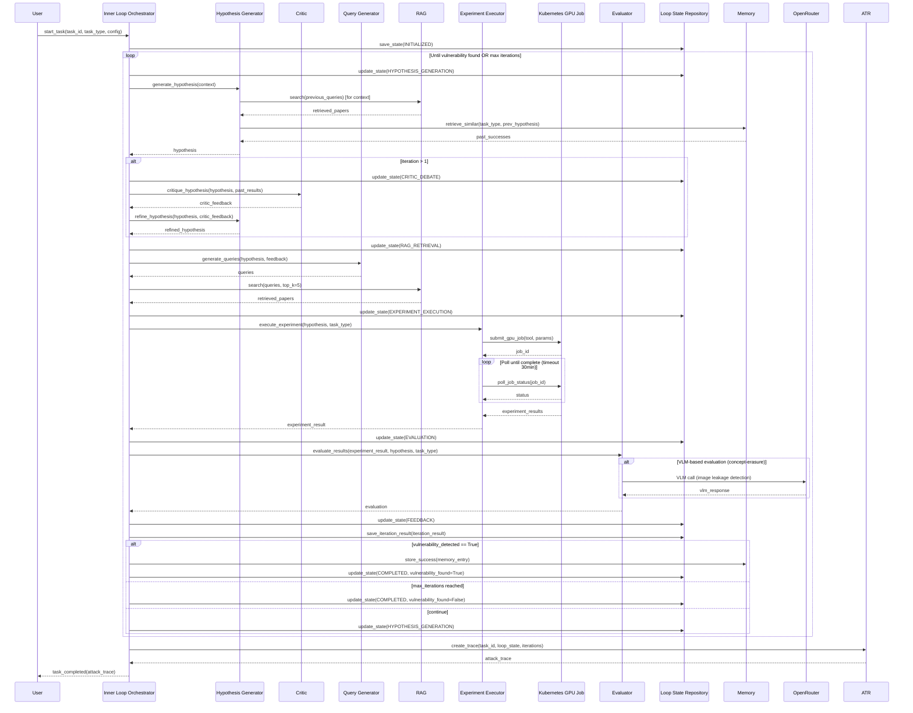
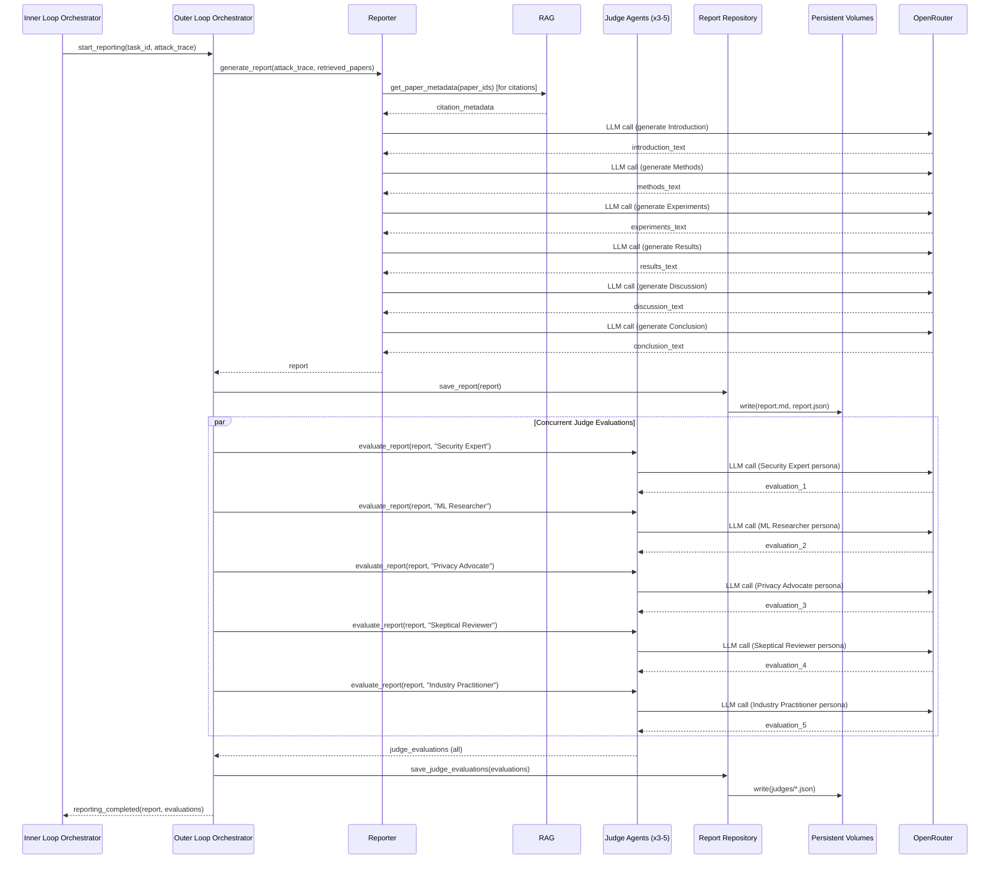
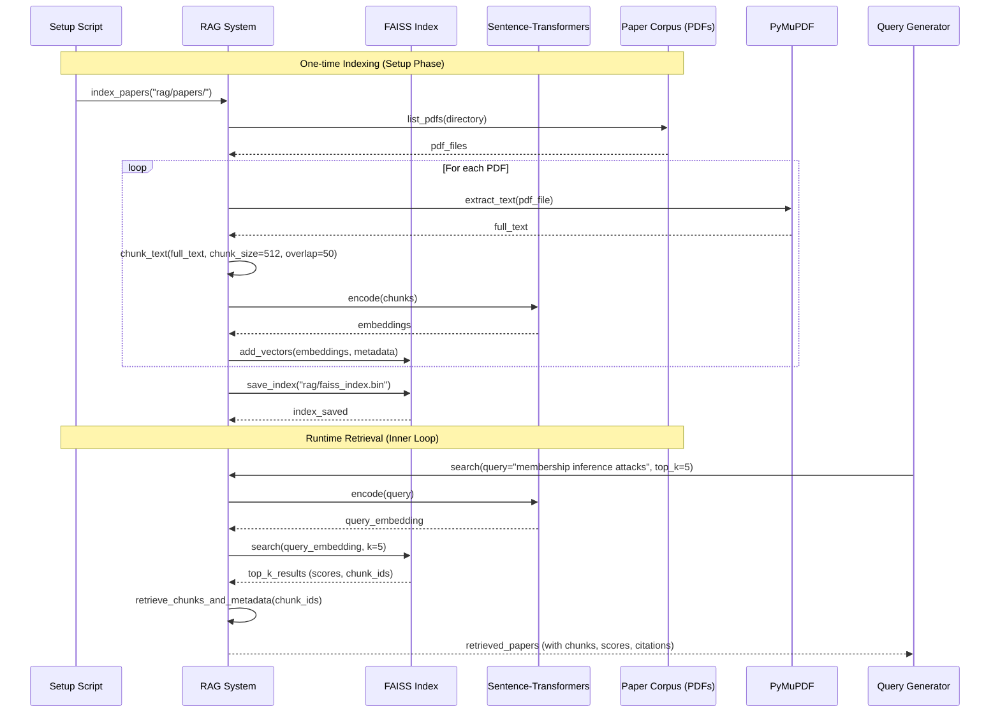

# AUST (AI Scientist for Autonomous Unlearning Security Testing) Architecture Document

## Introduction

This document outlines the overall project architecture for AUST (AI Scientist for Autonomous Unlearning Security Testing), including agent orchestration, data processing workflows, API integrations, and infrastructure deployment. Its primary goal is to serve as the guiding architectural blueprint for AI-driven development, ensuring consistency and adherence to chosen patterns and technologies.

The architecture is designed to support AUST's autonomous research workflow: an inner research loop that iteratively generates hypotheses, retrieves relevant research, executes experiments, and evaluates results until vulnerabilities are discovered; and an outer loop that generates academic reports and multi-perspective judge evaluations. The system operates on machine unlearning methods (both data-based unlearning and concept-based erasure) to discover exploitable vulnerabilities through adaptive adversarial testing.

### Starter Template or Existing Project

**N/A** - This is a greenfield project without a starter template. The project is built from scratch using custom agent orchestration with CAMEL-AI framework integration, custom MCP FunctionTools for experiment execution, and specialized RAG-based knowledge retrieval. The architecture leverages existing research tools (DeepUnlearn as git submodule, concept-erasure methods from GitHub) but requires custom integration layers and orchestration logic specific to the autonomous research workflow.

### Change Log

| Date | Version | Description | Author |
|------|---------|-------------|--------|
| 2025-10-16 | 0.1 | Initial architecture document creation | Winston (Architect Agent) |

## High Level Architecture

### Technical Summary

AUST implements a **stateful containerized agent orchestration system** running in Docker/Kubernetes with H200 GPU access. The architecture follows a **two-loop pattern**: an inner research loop that autonomously conducts experiments through multi-agent collaboration (Hypothesis Generator, Critic, Query Generator, Evaluator, Experiment Executor), and an outer reporting loop that generates academic papers and multi-perspective judge evaluations. The system uses **CAMEL-AI** in dev/editable mode for agent orchestration, **OpenRouter API** for flexible LLM/VLM access, **RAG (Retrieval-Augmented Generation)** with Qdrant vector database for paper retrieval, and **MCP FunctionTools** to integrate DeepUnlearn and concept-erasure methods. Core architectural patterns include **event-driven agent communication**, **repository pattern for data access**, and **strategy pattern for task-specific workflows** (data-based vs concept-erasure). This architecture supports the PRD goals of demonstrating autonomous end-to-end AI scientific research on machine unlearning vulnerabilities, with aggressive performance targets (< 30 min/iteration, < 5 hours total, ≥ 90% autonomy).

### High Level Overview

**Main Architectural Style**: Stateful Containerized Monolith with Multi-Agent Orchestration

AUST uses a monolithic application architecture running in Docker containers, orchestrated by Kubernetes for GPU resource management and persistent volume mounting. The monolith is internally structured as a multi-agent system with clear component boundaries and orchestration layers.

**Repository Structure**: Monorepo at https://github.com/vios-s/CAUST containing all components (agents, tools, RAG, memory, loop orchestration, experiments) with DeepUnlearn as a git submodule and CAMEL-AI installed in dev/editable mode in an `external/` directory.

**Service Architecture**: Single Python application with stateful execution. The application maintains loop state across iterations via persistent volumes, enabling restart/resume capabilities. Experiment execution is isolated for security, with timeout and retry logic for GPU job queue management.

**Primary Data Flow**:
1. **Inner Research Loop**: User initiates task → Inner Loop Orchestrator starts → Hypothesis Generator proposes attack (using RAG + memory + seed templates) → Critic debates (if iteration > 1) → Query Generator retrieves papers → Experiment Executor triggers unlearning/erasure via MCP FunctionTools → Evaluator assesses results (threshold-based or VLM-based) → feedback to next iteration → repeat until vulnerability found or max iterations
2. **Outer Reporting Loop**: Inner loop completes → Outer Loop Orchestrator starts → Reporter generates academic paper from attack traces → 3-5 Judge personas evaluate report → outputs saved to persistent volumes

**Key Architectural Decisions**:
- **Monorepo + Monolith for MVP**: Simplifies dependency management and enables atomic commits across components, critical for aggressive 3-week timeline
- **CAMEL-AI in dev mode**: Allows source code modifications and custom agent implementations beyond framework defaults
- **MCP FunctionTools for experiments**: Provides safe, versioned integration with external codebases (DeepUnlearn, concept-erasure repos)
- **RAG with vector DB**: Enables semantic search over research papers to improve hypothesis quality and novelty
- **Dual-format outputs**: JSON (machine-readable) + Markdown (human-readable) for attack traces and reports, supporting both analysis and paper integration
- **Task-specific strategies via prompts**: Unified workflow architecture with prompt-based differentiation for data-based vs concept-erasure tasks

### High Level Project Diagram

```mermaid
graph TB
    User[User/Researcher]

    subgraph InnerLoop[Inner Research Loop Orchestrator]
        HG[Hypothesis Generator]
        Critic[Critic Agent]
        QG[Query Generator]
        EE[Experiment Executor]
        Eval[Evaluator]
    end

    subgraph OuterLoop[Outer Reporting Loop]
        Reporter[Reporter Agent]
        Judges[Judge Agents x3-5]
    end

    subgraph KnowledgeLayer[Knowledge Layer]
        RAG[RAG System<br/>FAISS/Chroma]
        Memory[Long-Term Memory<br/>CAMEL-AI]
        Papers[Paper Corpus<br/>10-20 per domain]
    end

    subgraph ExperimentLayer[Experiment Execution Layer]
        DUFT[DeepUnlearn<br/>FunctionTool]
        CEFT[Concept-Erasure<br/>FunctionTool]
        GPU[H200 GPU<br/>Kubernetes Jobs]
    end

    subgraph ExternalAPIs[External Services]
        OpenRouter[OpenRouter API<br/>LLM/VLM]
    end

    subgraph Storage[Persistent Storage]
        Outputs[Outputs Volume<br/>traces/reports/judgments]
        LoopState[Loop State JSON]
        MemStore[Memory Store]
    end

    User -->|initiates task| InnerLoop
    HG -->|generates hypothesis| Critic
    Critic -->|challenges| HG
    HG -->|hypothesis needs| QG
    QG -->|search queries| RAG
    RAG -->|relevant papers| QG
    QG -->|retrieved knowledge| HG
    HG -->|hypothesis| EE
    EE -->|experiment params| DUFT
    EE -->|experiment params| CEFT
    DUFT -->|uses| GPU
    CEFT -->|uses| GPU
    EE -->|results| Eval
    Eval -->|feedback| HG
    Eval -->|vulnerability found?| InnerLoop

    InnerLoop -->|completed| OuterLoop
    Reporter -->|generates| Outputs
    Judges -->|evaluate| Outputs

    HG -.->|queries past successes| Memory
    Memory -.->|stores discoveries| MemStore
    RAG -.->|indexes| Papers

    HG -->|LLM calls| OpenRouter
    Critic -->|LLM calls| OpenRouter
    QG -->|LLM calls| OpenRouter
    Eval -->|VLM calls for concept-erasure| OpenRouter
    Reporter -->|LLM calls| OpenRouter
    Judges -->|LLM calls| OpenRouter

    InnerLoop -.->|persists state| LoopState
    OuterLoop -.->|saves outputs| Outputs

    style InnerLoop fill:#e1f5ff
    style OuterLoop fill:#fff4e1
    style KnowledgeLayer fill:#e8f5e9
    style ExperimentLayer fill:#fce4ec
    style ExternalAPIs fill:#f3e5f5
    style Storage fill:#fff8e1
```



### Architectural and Design Patterns

**Pattern Selection**: The following patterns have been selected to guide AUST's architecture. Each pattern addresses specific requirements from the PRD while maintaining simplicity for the aggressive 3-week timeline.

- **Two-Loop Orchestration Pattern (Inner/Outer Loops)**: Separates iterative research execution (inner) from result synthesis and evaluation (outer). *Rationale:* Aligns with PRD requirement for autonomous hypothesis-experiment-feedback cycles followed by academic reporting and judging. Enables clear exit conditions and state management between phases.

- **Multi-Agent Collaboration with Role-Based Specialization**: Distinct agents (Hypothesis Generator, Critic, Query Generator, Experiment Executor, Evaluator, Reporter, Judges) with specific responsibilities. *Rationale:* Enables modular development and testing (critical for 3-week timeline), supports PRD's requirement for debate/challenge mechanisms (Critic), and allows independent agent improvements without affecting others.

- **Repository Pattern for Data Access**: Abstract data access for loop state, memory, RAG retrieval, experiment results, and outputs. *Rationale:* Enables testing without external dependencies (mocking), supports future migration from file-based to database storage, and provides clear interfaces for state persistence (NFR14).

- **Strategy Pattern for Task-Specific Workflows**: Unified agent architecture with strategy selection (via prompts and configuration) for data-based vs concept-erasure tasks. *Rationale:* Avoids code duplication while supporting distinct evaluation methods (threshold-based vs VLM-based), enables prompt-based task differentiation as specified in PRD Technical Assumptions, and simplifies maintenance.

- **Adapter Pattern for External Tool Integration**: MCP FunctionTools serve as adapters wrapping DeepUnlearn and concept-erasure repositories. *Rationale:* Provides versioned, safe integration with external codebases, enables error handling and timeout logic at integration boundary, and supports PRD requirement for container isolation (NFR12).

- **Chain of Responsibility for Error Handling**: Errors propagate through orchestrator → agent → tool layers with appropriate handling at each level. *Rationale:* Supports NFR13 (OpenRouter rate limit handling), NFR6 (experiment timeout), and overall system resilience. Enables graceful degradation when components fail.

- **Event-Driven State Machine for Loop Control**: Inner loop orchestrator manages state transitions (HYPOTHESIS_GENERATION → CRITIC_DEBATE → RAG_RETRIEVAL → EXPERIMENT_EXECUTION → EVALUATION → FEEDBACK) with clear exit conditions. *Rationale:* Provides predictable loop behavior, enables loop state persistence for restart/resume (NFR14), and simplifies debugging through clear state tracking.

## Tech Stack

The technology stack selections below are the **single source of truth** for AUST development. All decisions are based on PRD requirements, performance targets (NFR6-NFR8), and the 3-week implementation timeline. Technologies are pinned to specific versions for reproducibility (NFR11).

### Cloud Infrastructure

- **Provider:** On-premises Kubernetes cluster (or cloud Kubernetes service if available - to be confirmed with user)
- **Key Services:**
  - Kubernetes for container orchestration and GPU job scheduling
  - Persistent Volumes for outputs, loop state, and memory storage
  - Job API for H200 GPU allocation and experiment execution
- **Deployment Regions:** Single cluster (on-premises or single cloud region)

### Technology Stack Table

| Category | Technology | Version | Purpose | Rationale |
|----------|-----------|---------|---------|-----------|
| **Language** | Python | 3.11.5 | Primary development language | Required by CAMEL-AI and DeepUnlearn; excellent ML/AI library ecosystem; team expertise |
| **Runtime** | Python | 3.11.5 | Application runtime | LTS Python version with modern features (match groups, better error messages) |
| **Agent Framework** | CAMEL-AI | dev/editable (latest main) | Multi-agent orchestration | Provides agent abstractions, memory system (FR10), and role-based agents; dev mode enables customization per PRD requirement |
| **LLM/VLM API** | OpenRouter | N/A (API service) | LLM/VLM access for agents | Supports multiple models (GPT-4o, Claude 3.5, GPT-4V) for flexibility; single API reduces integration complexity; per PRD NFR4 |
| **Containerization** | Docker | 24.0.7 | Application containerization | Provides reproducibility (NFR11), container isolation (NFR12), and supports Kubernetes deployment |
| **Orchestration** | Kubernetes | 1.28.x | Container orchestration and GPU management | Enables H200 GPU job scheduling (NFR1), persistent volumes (NFR14), and resource limits; production-grade resilience |
| **ML Library** | PyTorch | 2.8.0 | Deep learning framework | Required by DeepUnlearn and concept-erasure methods; CUDA support for H200 GPUs |
| **Embedding Model** | Sentence-Transformers | 2.2.2 | Text embeddings for RAG | Pre-trained models (all-MiniLM-L6-v2); fast local inference; avoids OpenRouter API calls for embeddings |
| **PDF Parsing** | PyMuPDF (fitz) | 1.23.8 | Extract text from research papers | Fast, reliable PDF text extraction; required for RAG paper corpus processing (FR5) |
| **Logging** | Python logging | 3.11 (stdlib) | Application logging | Structured logging with JSON formatting; no external dependencies; supports debugging and monitoring |
| **Configuration** | PyYAML | 6.0.1 | YAML config file parsing | Human-readable config files (prompts, thresholds, personas); easy versioning and iteration |
| **Testing** | pytest | 7.4.3 | Unit and integration testing | Standard Python testing framework; excellent plugin ecosystem; supports fixtures for complex test setups |
| **Testing Mocks** | pytest-mock | 3.12.0 | Mocking for external dependencies | Simplifies mocking OpenRouter API, GPU jobs, and external tools during testing |
| **Container Testing** | Testcontainers Python | 3.7.1 | Integration testing with containers | Enables testing with real FAISS, file system isolation; validates deployment configuration |
| **Git Submodule** | DeepUnlearn | commit SHA pinned | Data-based unlearning experiments | Provides unlearning method implementations per FR6; git submodule enables version control and local modifications |
| **Git Submodule** | Concept-Erasure Tools | TBD (specific repo to be selected) | Concept-erasure experiments | Provides concept-erasure implementations per FR7; specific tool to be selected in Epic 3 |
| **Dependency Management** | pip | 23.3.1 | Package installation | Standard Python package manager; requirements.txt with pinned versions (NFR11) |
| **IaC (if needed)** | Kubernetes YAML | N/A | Infrastructure as code | Native Kubernetes manifests (job.yaml, pvc.yaml); simple, version-controlled; no additional IaC tool needed for MVP |

### Elicitation: Tech Stack Review

**IMPORTANT**: This technology stack is the definitive selection for AUST. Please review the table above and confirm:

1. **Are there any gaps or missing technologies** that you expected to see based on the PRD?
2. **Do you disagree with any selections?** If so, which ones and why?
3. **Are there specific version requirements** for any technologies that differ from what's listed?
4. **Database selection**: The architecture currently uses FAISS (in-memory vector DB) and file-based storage (JSON for loop state, persistent volumes for outputs). Would you prefer a traditional database (PostgreSQL, MongoDB, etc.) for any components?
5. **Concept-Erasure Tool**: The specific concept-erasure repository is marked "TBD" - do you have a preferred tool (e.g., EraseDiff, specific concept ablation repo), or should we select during Epic 3 implementation?
6. **Cloud vs On-Premises**: Is AUST deploying to an on-premises Kubernetes cluster with H200s, or to a cloud provider (GCP, AWS, Azure) with GPU instances?

**Please provide feedback on the tech stack before we proceed to Data Models.** If everything looks correct, respond with "approved" or "proceed" to continue.

---

## Data Models

The following data models represent the core business entities and data structures in AUST. These models are conceptual and will be implemented as Python dataclasses or Pydantic models for validation and serialization.

### LoopState

**Purpose:** Tracks the current state of the inner research loop, enabling restart/resume capabilities and state persistence across container restarts.

**Key Attributes:**
- `task_id`: str - Unique identifier for the research task (e.g., "data-unlearning-task-001")
- `task_type`: str - Task type: "data_based_unlearning" or "concept_erasure"
- `current_iteration`: int - Current iteration number (1-10)
- `max_iterations`: int - Maximum allowed iterations (default 10)
- `current_state`: str - State machine state: "HYPOTHESIS_GENERATION", "CRITIC_DEBATE", "RAG_RETRIEVAL", "EXPERIMENT_EXECUTION", "EVALUATION", "FEEDBACK", "COMPLETED", "FAILED"
- `vulnerability_found`: bool - Flag indicating if vulnerability was discovered
- `started_at`: datetime - Loop start timestamp
- `updated_at`: datetime - Last state update timestamp
- `metadata`: dict - Additional task-specific metadata (dataset, model, target)

**Relationships:**
- Has many `IterationResult` (one per iteration)
- Has one `AttackTrace` (aggregated from all iterations)

**Persistence:** Serialized to JSON at `outputs/{task_id}/loop_state.json`, saved after each state transition.

### IterationResult

**Purpose:** Captures the results of a single inner loop iteration, including hypothesis, retrieved papers, experiment results, and evaluation feedback.

**Key Attributes:**
- `iteration_number`: int - Iteration number (1-10)
- `hypothesis`: Hypothesis - Generated hypothesis for this iteration
- `critic_feedback`: str | None - Critic agent's challenge/feedback (None for iteration 1)
- `rag_queries`: list[str] - Search queries generated by Query Generator
- `retrieved_papers`: list[RetrievedPaper] - Papers retrieved from RAG (top-k results)
- `experiment_params`: dict - Parameters passed to experiment executor
- `experiment_results`: ExperimentResult - Results from DeepUnlearn or concept-erasure tool
- `evaluation`: Evaluation - Evaluator's assessment of results
- `feedback_for_next`: str - Feedback message to next iteration
- `timestamp`: datetime - Iteration completion time
- `duration_seconds`: float - Time taken for this iteration

**Relationships:**
- Belongs to one `LoopState`
- Contains one `Hypothesis`, multiple `RetrievedPaper`, one `ExperimentResult`, one `Evaluation`

**Persistence:** Stored in `AttackTrace` (aggregated) and in `outputs/{task_id}/iterations/iteration_{n}.json` for debugging.

### Hypothesis

**Purpose:** Represents a proposed vulnerability test generated by the Hypothesis Generator agent.

**Key Attributes:**
- `hypothesis_id`: str - Unique identifier
- `attack_type`: str - Type of attack (e.g., "membership_inference", "model_inversion", "data_extraction", "concept_leakage")
- `description`: str - Natural language description of the hypothesis
- `rationale`: str - Reasoning for why this attack might succeed
- `target`: str - What the attack targets (e.g., specific data points, concepts)
- `expected_outcome`: str - What success looks like
- `confidence_score`: float - Generator's confidence (0.0-1.0)
- `novelty_score`: float - Estimated novelty based on memory/RAG (0.0-1.0)
- `generated_at`: datetime - Generation timestamp

**Relationships:**
- Belongs to one `IterationResult`

**Persistence:** Embedded in `IterationResult` JSON.

### RetrievedPaper

**Purpose:** Represents a research paper retrieved from the RAG system during a query.

**Key Attributes:**
- `paper_id`: str - Unique identifier (filename hash or DOI)
- `title`: str - Paper title
- `authors`: list[str] - List of authors
- `year`: int - Publication year
- `abstract`: str - Paper abstract
- `retrieved_chunks`: list[str] - Specific chunks/sections retrieved (with context)
- `relevance_score`: float - Similarity score from vector search (0.0-1.0)
- `citation_key`: str - BibTeX citation key for Reporter to use

**Relationships:**
- Referenced by multiple `IterationResult` (many-to-many via retrieval)
- Sourced from `PaperCorpus`

**Persistence:** Metadata stored in vector DB index; full paper stored as PDF in `rag/papers/` directory.

### ExperimentResult

**Purpose:** Contains the raw results from executing an experiment via DeepUnlearn or concept-erasure FunctionTools.

**Key Attributes:**
- `experiment_id`: str - Unique identifier
- `tool_used`: str - "deepunlearn" or "concept_erasure"
- `method`: str - Specific method executed (e.g., "SISA", "gradient_ascent", "EraseDiff")
- `execution_status`: str - "success", "failed", "timeout"
- `metrics`: dict - Method-specific metrics (e.g., {"forget_accuracy": 0.23, "retain_accuracy": 0.89})
- `outputs`: dict - Additional outputs (model checkpoints, generated images, logs)
- `error_message`: str | None - Error details if execution_status == "failed"
- `execution_time_seconds`: float - Time taken for experiment
- `gpu_job_id`: str | None - Kubernetes job ID if applicable

**Relationships:**
- Belongs to one `IterationResult`

**Persistence:** Embedded in `IterationResult` JSON; large artifacts (model checkpoints, images) stored in `outputs/{task_id}/experiments/{experiment_id}/`.

### Evaluation

**Purpose:** Represents the Evaluator agent's assessment of experiment results, determining if a vulnerability was found and providing feedback.

**Key Attributes:**
- `evaluation_id`: str - Unique identifier
- `evaluation_type`: str - "threshold_based" (data-based) or "vlm_based" (concept-erasure)
- `vulnerability_detected`: bool - Whether a vulnerability was found
- `confidence`: float - Evaluator's confidence in the assessment (0.0-1.0)
- `evidence`: str - Explanation of why vulnerability was/wasn't detected
- `threshold_comparison`: dict | None - For threshold-based: {"metric": "forget_accuracy", "threshold": 0.3, "actual": 0.23, "passed": true}
- `vlm_analysis`: dict | None - For VLM-based: {"prompt": "...", "response": "...", "leakage_detected": true}
- `feedback`: str - Actionable feedback for next iteration (or confirmation if vulnerability found)

**Relationships:**
- Belongs to one `IterationResult`

**Persistence:** Embedded in `IterationResult` JSON.

### AttackTrace

**Purpose:** Aggregates the complete research journey from initial hypothesis to vulnerability discovery, formatted for paper integration and user reproduction.

**Key Attributes:**
- `task_id`: str - Links to LoopState
- `task_type`: str - "data_based_unlearning" or "concept_erasure"
- `vulnerability_found`: bool - Overall success flag
- `total_iterations`: int - Number of iterations completed
- `trace_steps`: list[TraceStep] - Ordered list of iteration summaries
- `final_vulnerability`: Hypothesis | None - The successful hypothesis (if found)
- `final_evidence`: str - Summary of evidence supporting the vulnerability
- `reproducibility_instructions`: str - Step-by-step instructions for reproduction
- `created_at`: datetime - Trace creation timestamp

**Relationships:**
- Belongs to one `LoopState`
- Aggregates information from multiple `IterationResult`

**Persistence:** Dual format - JSON at `outputs/{task_id}/attack_trace.json` and Markdown at `outputs/{task_id}/attack_trace.md`.

### TraceStep

**Purpose:** Summarizes a single iteration within an AttackTrace for readability.

**Key Attributes:**
- `iteration`: int - Iteration number
- `hypothesis_summary`: str - Brief description of the hypothesis
- `key_papers`: list[str] - Titles of most relevant papers retrieved
- `experiment_summary`: str - What was tested and how
- `result_summary`: str - Outcome of the experiment
- `feedback_summary`: str - What was learned for next iteration

**Relationships:**
- Embedded within `AttackTrace`

**Persistence:** Embedded in `AttackTrace` JSON/Markdown.

### Report

**Purpose:** Represents the academic paper generated by the Reporter agent in the outer loop.

**Key Attributes:**
- `report_id`: str - Unique identifier
- `task_id`: str - Links to LoopState
- `title`: str - Paper title
- `abstract`: str - Paper abstract
- `sections`: dict - Keyed sections: {"introduction": "...", "methods": "...", "experiments": "...", "results": "...", "discussion": "...", "conclusion": "..."}
- `citations`: list[str] - BibTeX citations extracted from retrieved papers
- `figures`: list[str] - Paths to generated figures/visualizations
- `generated_at`: datetime - Report generation timestamp

**Relationships:**
- Belongs to one `LoopState`
- References multiple `RetrievedPaper` (for citations)
- Has many `JudgeEvaluation` (3-5 judges)

**Persistence:** Markdown at `outputs/{task_id}/report.md`, LaTeX at `outputs/{task_id}/report.tex` (optional).

### JudgeEvaluation

**Purpose:** Represents a single LLM judge's evaluation of a Report from a specific perspective.

**Key Attributes:**
- `judge_id`: str - Unique identifier
- `persona`: str - Judge persona: "Security Expert", "ML Researcher", "Privacy Advocate", "Skeptical Reviewer", "Industry Practitioner"
- `evaluation_criteria`: list[str] - Criteria evaluated (novelty, rigor, reproducibility, impact, exploitability)
- `scores`: dict - Scores per criterion: {"novelty": 8, "rigor": 7, "reproducibility": 9, "impact": 7, "exploitability": 8}
- `overall_score`: float - Weighted average score (0-10)
- `strengths`: list[str] - Identified strengths of the research
- `weaknesses`: list[str] - Identified weaknesses or concerns
- `comments`: str - Detailed feedback from judge's perspective
- `recommendation`: str - "Accept", "Minor Revisions", "Major Revisions", "Reject"

**Relationships:**
- Belongs to one `Report`

**Persistence:** JSON at `outputs/{task_id}/judges/judge_{persona}.json`.

### AgentPromptConfig

**Purpose:** Configuration for agent prompts, enabling easy iteration and version control.

**Key Attributes:**
- `agent_name`: str - "hypothesis_generator", "critic", "query_generator", "evaluator", "reporter", "judge"
- `task_type`: str | None - "data_based_unlearning", "concept_erasure", or None for generic
- `system_prompt`: str - Agent's system/role prompt
- `user_prompt_template`: str - Template with placeholders (e.g., "{retrieved_papers}", "{past_results}")
- `model`: str - OpenRouter model to use (e.g., "anthropic/claude-3.5-sonnet")
- `temperature`: float - Sampling temperature (0.0-1.0)
- `max_tokens`: int - Maximum response tokens

**Relationships:**
- Loaded by agents at initialization

**Persistence:** YAML files in `configs/prompts/{agent_name}_{task_type}.yaml`.

### MemoryEntry

**Purpose:** Represents a stored successful vulnerability discovery in CAMEL-AI's long-term memory for future reference.

**Key Attributes:**
- `entry_id`: str - Unique identifier
- `task_type`: str - "data_based_unlearning" or "concept_erasure"
- `successful_hypothesis`: Hypothesis - The hypothesis that discovered a vulnerability
- `key_insights`: list[str] - Lessons learned from this discovery
- `attack_pattern`: str - General pattern that can be reused
- `created_at`: datetime - Memory storage timestamp

**Relationships:**
- Referenced by Hypothesis Generator for inspiration

**Persistence:** Managed by CAMEL-AI memory system (implementation-specific storage).

## Components

AUST is structured into logical components with clear responsibilities and interfaces. The architecture follows the repository structure from the PRD (monorepo with agents/, tools/, rag/, memory/, loop/, outputs/, configs/ directories).

### Inner Loop Orchestrator

**Responsibility:** Manages the state machine for the inner research loop, coordinating agent execution, handling state transitions, and persisting loop state across iterations.

**Key Interfaces:**
- `start_task(task_id: str, task_type: str, config: dict) -> None` - Initializes a new research task
- `resume_task(task_id: str) -> None` - Resumes from saved loop state
- `execute_iteration() -> IterationResult` - Runs one complete loop iteration
- `check_exit_condition() -> tuple[bool, str]` - Determines if loop should exit (vulnerability found or max iterations)
- `get_state() -> LoopState` - Returns current loop state

**Dependencies:**
- Hypothesis Generator Agent
- Critic Agent
- Query Generator Agent
- Experiment Executor
- Evaluator Agent
- Loop State Repository
- Configuration Manager

**Technology Stack:** Python 3.11, CAMEL-AI agent orchestration, async/await for agent coordination

**Implementation Notes:** Implements event-driven state machine pattern. Persists state after each transition to enable restart/resume (NFR14). Includes timeout and retry logic for agent calls to handle OpenRouter rate limits (NFR13).

### Outer Loop Orchestrator

**Responsibility:** Manages the outer reporting loop, coordinating Reporter and Judge agents after inner loop completion.

**Key Interfaces:**
- `start_reporting(task_id: str, attack_trace: AttackTrace) -> Report` - Generates academic report
- `run_judges(report: Report) -> list[JudgeEvaluation]` - Executes all judge personas
- `save_outputs(task_id: str, report: Report, evaluations: list[JudgeEvaluation]) -> None` - Persists final outputs

**Dependencies:**
- Reporter Agent
- Judge Agents (3-5 instances with different personas)
- Report Repository
- Attack Trace Repository
- Configuration Manager

**Technology Stack:** Python 3.11, CAMEL-AI agent orchestration, concurrent judge execution (asyncio)

**Implementation Notes:** Runs judge agents concurrently for performance. Aggregates judge evaluations into summary statistics. Saves outputs in multiple formats (Markdown, JSON, optionally LaTeX).

### Hypothesis Generator Agent

**Responsibility:** Proposes targeted vulnerability tests for unlearning methods based on retrieved papers, past experiment results, seed templates, and memory.

**Key Interfaces:**
- `generate_hypothesis(context: HypothesisContext) -> Hypothesis` - Generates a new hypothesis
- `refine_hypothesis(hypothesis: Hypothesis, critic_feedback: str) -> Hypothesis` - Refines based on Critic feedback

**Dependencies:**
- OpenRouter API (LLM calls)
- Memory System (past successful hypotheses)
- RAG System (for context on retrieved papers)
- Seed Template Repository (3-5 known attack patterns)
- Agent Prompt Config

**Technology Stack:** Python 3.11, CAMEL-AI BaseAgent, OpenRouter API client, prompt templates from configs/

**Implementation Notes:** Uses prompt engineering with task-specific differentiation (data-based vs concept-erasure via Strategy pattern). Scores hypotheses for novelty by checking similarity to memory entries. Includes seed template fallback for early iterations to mitigate hypothesis quality risk.

### Critic Agent

**Responsibility:** Debates with Hypothesis Generator after the first iteration to challenge and improve hypothesis quality.

**Key Interfaces:**
- `critique_hypothesis(hypothesis: Hypothesis, past_results: list[IterationResult]) -> str` - Provides critical feedback

**Dependencies:**
- OpenRouter API (LLM calls)
- Agent Prompt Config

**Technology Stack:** Python 3.11, CAMEL-AI BaseAgent, OpenRouter API client

**Implementation Notes:** Only activated after iteration 1 (per PRD FR3). Uses adversarial prompting to challenge hypothesis assumptions, rigor, and novelty. Feedback is incorporated into hypothesis refinement before experiment execution.

### Query Generator Agent

**Responsibility:** Converts evaluation feedback and hypothesis needs into semantic search queries for the RAG system.

**Key Interfaces:**
- `generate_queries(hypothesis: Hypothesis, feedback: str | None, iteration: int) -> list[str]` - Generates 2-5 search queries

**Dependencies:**
- OpenRouter API (LLM calls)
- Agent Prompt Config

**Technology Stack:** Python 3.11, CAMEL-AI BaseAgent, OpenRouter API client

**Implementation Notes:** Generates multiple diverse queries to maximize RAG coverage. Incorporates feedback from previous iteration to refine search focus. Returns 2-5 queries ranked by expected relevance.

### Experiment Executor

**Responsibility:** Executes unlearning experiments by invoking DeepUnlearn or concept-erasure FunctionTools with hypothesis-specified parameters.

**Key Interfaces:**
- `execute_experiment(hypothesis: Hypothesis, task_type: str) -> ExperimentResult` - Runs the experiment
- `submit_gpu_job(tool: str, params: dict) -> str` - Submits Kubernetes GPU job
- `poll_job_status(job_id: str) -> tuple[str, dict | None]` - Checks job status and retrieves results

**Dependencies:**
- DeepUnlearn FunctionTool
- Concept-Erasure FunctionTool
- Kubernetes Job API (for H200 GPU jobs)
- Experiment Repository (for result persistence)

**Technology Stack:** Python 3.11, Kubernetes Python client, PyTorch 2.8.0 (within tools), MCP FunctionTool adapters

**Implementation Notes:** Implements Adapter pattern for external tool integration. Includes timeout logic (30 min per NFR6), retry for transient GPU availability issues, and container isolation for security (NFR12). Handles both data-based and concept-erasure tasks via strategy selection.

### Evaluator Agent

**Responsibility:** Assesses experiment results to determine if a vulnerability was discovered, using threshold-based metrics for data-based tasks or VLM-based analysis for concept-erasure tasks.

**Key Interfaces:**
- `evaluate_results(experiment_result: ExperimentResult, hypothesis: Hypothesis, task_type: str) -> Evaluation` - Evaluates experiment outcome

**Dependencies:**
- OpenRouter API (VLM calls for concept-erasure evaluation)
- Evaluation Threshold Config (loaded from configs/)
- Agent Prompt Config (for VLM prompts)

**Technology Stack:** Python 3.11, CAMEL-AI BaseAgent, OpenRouter API client (VLM models like GPT-4V)

**Implementation Notes:** Uses Strategy pattern for evaluation type selection. Threshold-based: compares metrics (forget accuracy, retain accuracy, CLIP scores) against configurable thresholds. VLM-based: generates images/text from concept-erased models, prompts VLM to detect leakage. Returns detailed evidence and actionable feedback for next iteration.

### Reporter Agent

**Responsibility:** Generates academic-format research reports (Introduction, Methods, Experiments, Results, Discussion, Conclusion) with citation integration from retrieved papers.

**Key Interfaces:**
- `generate_report(attack_trace: AttackTrace, retrieved_papers: list[RetrievedPaper]) -> Report` - Generates complete report

**Dependencies:**
- OpenRouter API (LLM calls)
- Attack Trace Repository
- Retrieved Papers Repository
- Agent Prompt Config

**Technology Stack:** Python 3.11, CAMEL-AI BaseAgent, OpenRouter API client, BibTeX parsing libraries

**Implementation Notes:** Structures report into standard academic sections. Extracts citations from retrieved papers used during inner loop. Includes figures/visualizations from experiment results. Outputs Markdown format (primary) with optional LaTeX generation for submission.

### Judge Agents

**Responsibility:** Evaluate generated reports from multiple perspectives (novelty, rigor, reproducibility, impact, exploitability) using pre-defined LLM personas.

**Key Interfaces:**
- `evaluate_report(report: Report, persona: str, criteria: list[str]) -> JudgeEvaluation` - Evaluates from specific persona

**Dependencies:**
- OpenRouter API (LLM calls)
- Judge Persona Config (loaded from configs/)
- Agent Prompt Config

**Technology Stack:** Python 3.11, CAMEL-AI BaseAgent, OpenRouter API client

**Implementation Notes:** 3-5 judge instances with different personas: Security Expert, ML Researcher, Privacy Advocate, Skeptical Reviewer, Industry Practitioner. Each uses persona-specific prompts and evaluation criteria from configs/. Judges run concurrently (asyncio) in Outer Loop Orchestrator. Outputs structured evaluations with scores, strengths/weaknesses, and recommendations.

### RAG System

**Responsibility:** Provides semantic search over research paper corpus (10-20 papers per domain) to retrieve relevant context for hypothesis generation.

**Key Interfaces:**
- `index_papers(paper_directory: str) -> None` - Indexes PDFs into vector database
- `search(query: str, top_k: int = 5) -> list[RetrievedPaper]` - Retrieves top-k relevant papers/chunks
- `get_paper_metadata(paper_id: str) -> dict` - Returns citation metadata for a paper

**Dependencies:**
- FAISS vector database
- Sentence-Transformers (all-MiniLM-L6-v2 embedding model)
- PyMuPDF (PDF text extraction)
- Paper Corpus (PDFs in rag/papers/)

**Technology Stack:** Python 3.11, FAISS 1.7.4, Sentence-Transformers 2.2.2, PyMuPDF 1.23.8

**Implementation Notes:** Chunks papers into semantically coherent sections (paragraph-level with overlap). Embeds using local Sentence-Transformers model (avoids OpenRouter API calls). FAISS index loaded in-memory for < 5s retrieval (NFR8). Supports paper corpus structure: rag/papers/data_unlearning/, rag/papers/concept_erasure/, rag/papers/attack_methods/.

### Memory System

**Responsibility:** Stores and retrieves successful vulnerability discoveries for inspiration in future hypothesis generation (CAMEL-AI long-term memory integration).

**Key Interfaces:**
- `store_success(memory_entry: MemoryEntry) -> None` - Stores a successful discovery
- `retrieve_similar(task_type: str, hypothesis: Hypothesis, top_k: int = 3) -> list[MemoryEntry]` - Retrieves similar past successes
- `get_all_patterns(task_type: str) -> list[str]` - Returns all attack patterns for a task type

**Dependencies:**
- CAMEL-AI Memory Module
- Embedding model (for similarity search)

**Technology Stack:** Python 3.11, CAMEL-AI memory system (file-based or vector-based depending on CAMEL-AI implementation)

**Implementation Notes:** Wraps CAMEL-AI's long-term memory abstractions. Stores successful hypotheses, key insights, and reusable attack patterns. Queried by Hypothesis Generator to avoid redundant exploration and boost novelty. Persistence managed by CAMEL-AI framework.

### DeepUnlearn FunctionTool

**Responsibility:** Adapter wrapping DeepUnlearn git submodule for data-based unlearning experiments.

**Key Interfaces:**
- `unlearn_model(method: str, dataset: str, params: dict) -> dict` - Triggers unlearning
- `evaluate_model(model_path: str, metrics: list[str]) -> dict` - Evaluates unlearned model

**Dependencies:**
- DeepUnlearn git submodule (submodules/DeepUnlearn/)
- PyTorch 2.8.0
- Kubernetes Job API (for GPU execution)

**Technology Stack:** Python 3.11, MCP FunctionTool pattern, DeepUnlearn codebase

**Implementation Notes:** Implements Adapter pattern to expose DeepUnlearn methods as standardized FunctionTool interface. Handles parameter translation from hypothesis to DeepUnlearn CLI/API. Submits Kubernetes GPU job for execution. Returns standardized ExperimentResult with metrics (forget accuracy, retain accuracy, time).

### Concept-Erasure FunctionTool

**Responsibility:** Adapter wrapping concept-erasure methods (e.g., EraseDiff, concept ablation tools) for concept-based unlearning experiments.

**Key Interfaces:**
- `erase_concept(method: str, model: str, concept: str, params: dict) -> dict` - Triggers concept erasure
- `generate_samples(model_path: str, prompt: str, num_samples: int) -> list[str]` - Generates samples for VLM evaluation

**Dependencies:**
- Concept-Erasure git submodule or repository (specific tool TBD in Epic 3)
- PyTorch 2.8.0
- Kubernetes Job API (for GPU execution)

**Technology Stack:** Python 3.11, MCP FunctionTool pattern, concept-erasure codebase

**Implementation Notes:** Similar adapter pattern to DeepUnlearn FunctionTool. Specific tool to be selected during Epic 3 based on PRD Technical Assumptions. Handles both model modification and sample generation for VLM-based leakage detection. Returns standardized ExperimentResult with outputs (model checkpoint, generated images/text, CLIP scores).

### Loop State Repository

**Responsibility:** Abstracts persistence of loop state to enable restart/resume and state tracking.

**Key Interfaces:**
- `save_state(loop_state: LoopState) -> None` - Persists loop state
- `load_state(task_id: str) -> LoopState` - Loads loop state
- `update_state(task_id: str, updates: dict) -> None` - Partial state update
- `state_exists(task_id: str) -> bool` - Checks if state file exists

**Dependencies:**
- Persistent Volume (Kubernetes PVC)
- JSON serialization

**Technology Stack:** Python 3.11, JSON, file I/O

**Implementation Notes:** Implements Repository pattern. File-based storage: outputs/{task_id}/loop_state.json on persistent volume. Atomic writes (write to temp file, then rename) to prevent corruption. Future migration to database (PostgreSQL, MongoDB) possible without changing interface.

### Attack Trace Repository

**Responsibility:** Manages creation and persistence of attack traces in dual format (JSON + Markdown).

**Key Interfaces:**
- `create_trace(task_id: str, loop_state: LoopState, iterations: list[IterationResult]) -> AttackTrace` - Generates trace
- `save_trace(attack_trace: AttackTrace) -> None` - Persists trace in dual format
- `load_trace(task_id: str) -> AttackTrace` - Loads trace

**Dependencies:**
- Persistent Volume
- Markdown templating library

**Technology Stack:** Python 3.11, Jinja2 (for Markdown templating), JSON

**Implementation Notes:** Implements Repository pattern. Aggregates iteration results into human-readable narrative. Dual-format output: JSON (outputs/{task_id}/attack_trace.json) for machine parsing, Markdown (outputs/{task_id}/attack_trace.md) for paper integration and user reproduction. Markdown format prioritizes readability per NFR9 (80%+ reproducibility).

### Configuration Manager

**Responsibility:** Loads and manages all configuration files (prompts, thresholds, judge personas, task configs).

**Key Interfaces:**
- `load_agent_config(agent_name: str, task_type: str | None) -> AgentPromptConfig` - Loads agent prompt config
- `load_evaluation_thresholds(task_type: str) -> dict` - Loads evaluation thresholds
- `load_judge_personas() -> list[dict]` - Loads judge persona configs
- `load_task_config(task_type: str) -> dict` - Loads task-specific config (seed templates, etc.)

**Dependencies:**
- configs/ directory structure
- PyYAML parser

**Technology Stack:** Python 3.11, PyYAML 6.0.1

**Implementation Notes:** Centralized config management. YAML-based configs for human readability and version control. Validates configs against schemas on load. Caches loaded configs to avoid repeated file reads. Supports hot-reloading for prompt iteration during development.

### Component Diagrams

```mermaid
graph TB
    subgraph Orchestration Layer
        ILO[Inner Loop<br/>Orchestrator]
        OLO[Outer Loop<br/>Orchestrator]
    end

    subgraph Agent Layer
        HG[Hypothesis<br/>Generator]
        Critic[Critic<br/>Agent]
        QG[Query<br/>Generator]
        Eval[Evaluator<br/>Agent]
        Reporter[Reporter<br/>Agent]
        Judges[Judge<br/>Agents x3-5]
    end

    subgraph Tool Layer
        EE[Experiment<br/>Executor]
        DUFT[DeepUnlearn<br/>FunctionTool]
        CEFT[Concept-Erasure<br/>FunctionTool]
    end

    subgraph Knowledge Layer
        RAG[RAG<br/>System]
        Memory[Memory<br/>System]
    end

    subgraph Repository Layer
        LSR[Loop State<br/>Repository]
        ATR[Attack Trace<br/>Repository]
        RR[Report<br/>Repository]
        CM[Configuration<br/>Manager]
    end

    subgraph External
        OR[OpenRouter<br/>API]
        K8s[Kubernetes<br/>GPU Jobs]
        PV[Persistent<br/>Volumes]
    end

    ILO -->|coordinates| HG
    ILO -->|coordinates| Critic
    ILO -->|coordinates| QG
    ILO -->|coordinates| EE
    ILO -->|coordinates| Eval
    ILO -->|persists to| LSR
    ILO -->|generates| ATR

    OLO -->|coordinates| Reporter
    OLO -->|coordinates| Judges
    OLO -->|persists to| RR

    HG -->|LLM calls| OR
    HG -->|queries| Memory
    HG -->|uses context| RAG

    Critic -->|LLM calls| OR

    QG -->|LLM calls| OR
    QG -->|searches| RAG

    EE -->|invokes| DUFT
    EE -->|invokes| CEFT

    Eval -->|VLM calls| OR

    Reporter -->|LLM calls| OR
    Reporter -->|cites| RAG

    Judges -->|LLM calls| OR

    DUFT -->|submits| K8s
    CEFT -->|submits| K8s

    LSR -->|stores| PV
    ATR -->|stores| PV
    RR -->|stores| PV

    HG -->|loads config| CM
    Critic -->|loads config| CM
    QG -->|loads config| CM
    Eval -->|loads config| CM
    Reporter -->|loads config| CM
    Judges -->|loads config| CM

    Memory -->|persists| PV
    RAG -->|indexes from| PV

    style Orchestration Layer fill:#e1f5ff
    style Agent Layer fill:#fff4e1
    style Tool Layer fill:#fce4ec
    style Knowledge Layer fill:#e8f5e9
    style Repository Layer fill:#f3e5f5
    style External fill:#fff8e1
```



## External APIs

AUST integrates with external services for LLM/VLM access and infrastructure management.

### OpenRouter API

- **Purpose:** Provides unified access to multiple LLM and VLM models (GPT-4o, Claude 3.5 Sonnet, GPT-4V) for agent intelligence
- **Documentation:** https://openrouter.ai/docs
- **Base URL(s):** https://openrouter.ai/api/v1
- **Authentication:** Bearer token authentication via API key (passed in `Authorization: Bearer $OPENROUTER_API_KEY` header)
- **Rate Limits:** Model-specific rate limits; varies by provider (e.g., GPT-4: 10k RPM, Claude: 5k RPM). Implement exponential backoff retry logic.

**Key Endpoints Used:**
- `POST /chat/completions` - Generates LLM responses for agents (Hypothesis Generator, Critic, Query Generator, Reporter, Judges)
- `POST /chat/completions` (with vision models) - VLM-based evaluation for concept-erasure leakage detection (Evaluator Agent)

**Integration Notes:**
- All agent LLM calls route through OpenRouter client wrapper for centralized rate limit handling, retry logic, and error management
- Model selection configurable per agent via `AgentPromptConfig` (allows different models for different agents)
- Timeout: 60s per request with 3 retries and exponential backoff (2s, 4s, 8s)
- Cost tracking: Log model usage (tokens, cost estimates) for budget monitoring
- Error handling: Graceful degradation on rate limits (wait + retry), fail tasks on persistent errors

### Kubernetes Job API

- **Purpose:** Submits and manages GPU jobs for experiment execution (DeepUnlearn and concept-erasure tools)
- **Documentation:** https://kubernetes.io/docs/reference/kubernetes-api/workload-resources/job-v1/
- **Base URL(s):** Cluster-specific Kubernetes API server (configured via kubeconfig)
- **Authentication:** Service account token (mounted in pod at `/var/run/secrets/kubernetes.io/serviceaccount/token`)
- **Rate Limits:** API server rate limits (typically 50 QPS per client)

**Key Endpoints Used:**
- `POST /apis/batch/v1/namespaces/{namespace}/jobs` - Creates GPU job for experiment execution
- `GET /apis/batch/v1/namespaces/{namespace}/jobs/{name}` - Polls job status
- `GET /api/v1/namespaces/{namespace}/pods` - Retrieves pod logs for experiment results
- `DELETE /apis/batch/v1/namespaces/{namespace}/jobs/{name}` - Cleans up completed jobs

**Integration Notes:**
- Experiment Executor submits GPU jobs with H200 resource requests (`nvidia.com/gpu: 1`)
- Job template includes persistent volume mounts for outputs/, experiment artifacts, and DeepUnlearn/concept-erasure codebases
- Timeout: 30 minutes per job (NFR6), job killed if exceeded
- Retry logic: Transient GPU unavailability (queue full) triggers 3 retries with 5-minute backoff
- Job cleanup: Completed jobs deleted after results retrieved to avoid quota limits
- Security: Jobs run with restricted security context (`runAsNonRoot`, `readOnlyRootFilesystem` where possible)

## Core Workflows

The following sequence diagrams illustrate critical system workflows, showing component interactions and data flow.

### Inner Research Loop Workflow



### Outer Reporting Loop Workflow



### RAG Indexing and Retrieval Workflow



## Database Schema

AUST uses **file-based storage** with JSON serialization for MVP simplicity and persistence via Kubernetes persistent volumes. No traditional database (SQL or NoSQL) is used in the MVP; all data is stored as JSON files with schema validation via Pydantic models.

### File-Based Storage Structure

```
outputs/
└── {task_id}/
    ├── loop_state.json                    # LoopState model
    ├── attack_trace.json                  # AttackTrace model (JSON)
    ├── attack_trace.md                    # AttackTrace model (Markdown)
    ├── report.md                          # Report model (Markdown)
    ├── report.json                        # Report model (JSON)
    ├── iterations/
    │   ├── iteration_1.json               # IterationResult model
    │   ├── iteration_2.json
    │   └── ...
    ├── experiments/
    │   ├── {experiment_id}/
    │   │   ├── model_checkpoint.pth       # Experiment artifacts
    │   │   ├── generated_images/
    │   │   └── logs.txt
    │   └── ...
    └── judges/
        ├── judge_security_expert.json     # JudgeEvaluation model
        ├── judge_ml_researcher.json
        └── ...

rag/
├── papers/
│   ├── data_unlearning/
│   │   ├── paper1.pdf
│   │   ├── paper2.pdf
│   │   └── ...
│   ├── concept_erasure/
│   │   ├── paper1.pdf
│   │   └── ...
│   └── attack_methods/
│       ├── paper1.pdf
│       └── ...
├── faiss_index.bin                        # FAISS vector index
└── paper_metadata.json                    # Paper metadata for citations

configs/
├── prompts/
│   ├── hypothesis_generator_data_based.yaml    # AgentPromptConfig
│   ├── hypothesis_generator_concept_erasure.yaml
│   ├── critic.yaml
│   ├── query_generator.yaml
│   ├── evaluator_data_based.yaml
│   ├── evaluator_concept_erasure.yaml
│   ├── reporter.yaml
│   └── judges.yaml
├── thresholds/
│   ├── data_based.yaml                    # Evaluation thresholds
│   └── concept_erasure.yaml
├── tasks/
│   ├── data_based_unlearning.yaml         # Task-specific config (seed templates)
│   └── concept_erasure.yaml
└── personas/
    └── judges.yaml                        # Judge persona definitions

memory/
└── [managed by CAMEL-AI memory system]    # MemoryEntry storage (implementation-specific)
```

### Schema Definitions (Pydantic Models)

All data models defined in the Data Models section are implemented as Pydantic models with schema validation:

```python
# Example: loop/models.py
from pydantic import BaseModel, Field
from datetime import datetime
from typing import Optional

class LoopState(BaseModel):
    task_id: str = Field(..., description="Unique task identifier")
    task_type: str = Field(..., pattern="^(data_based_unlearning|concept_erasure)$")
    current_iteration: int = Field(ge=0, le=10)
    max_iterations: int = Field(default=10, ge=1, le=20)
    current_state: str = Field(..., pattern="^(HYPOTHESIS_GENERATION|CRITIC_DEBATE|RAG_RETRIEVAL|EXPERIMENT_EXECUTION|EVALUATION|FEEDBACK|COMPLETED|FAILED)$")
    vulnerability_found: bool = False
    started_at: datetime
    updated_at: datetime
    metadata: dict = Field(default_factory=dict)
```

**Schema Validation:** All JSON files are validated against Pydantic models on read/write, ensuring data integrity and preventing corruption.

**Migration Path:** Repository pattern abstractions enable future migration to PostgreSQL or MongoDB without changing component interfaces. Database schema would directly map to Pydantic models.

## Source Tree

The following directory structure reflects the monorepo architecture, component organization, and file-based storage design:

```plaintext
CAUST/                                    # Monorepo root (https://github.com/vios-s/CAUST)
├── README.md                             # Project documentation
├── requirements.txt                      # Pinned Python dependencies (NFR11)
├── setup.py                              # Package setup for local development
├── .gitignore
├── .gitmodules                           # Git submodules config
│
├── docker/                               # Docker and Kubernetes configs
│   ├── Dockerfile                        # Main application container
│   ├── job.yaml                          # Kubernetes GPU job template
│   ├── pvc.yaml                          # Persistent volume claims
│   └── deployment.yaml                   # Kubernetes deployment (if needed)
│
├── configs/                              # Configuration files (YAML)
│   ├── prompts/                          # Agent prompt configurations
│   │   ├── hypothesis_generator_data_based.yaml
│   │   ├── hypothesis_generator_concept_erasure.yaml
│   │   ├── critic.yaml
│   │   ├── query_generator.yaml
│   │   ├── evaluator_data_based.yaml
│   │   ├── evaluator_concept_erasure.yaml
│   │   ├── reporter.yaml
│   │   └── judges.yaml
│   ├── thresholds/                       # Evaluation thresholds
│   │   ├── data_based.yaml
│   │   └── concept_erasure.yaml
│   ├── tasks/                            # Task-specific configs (seed templates)
│   │   ├── data_based_unlearning.yaml
│   │   └── concept_erasure.yaml
│   └── personas/                         # Judge personas
│       └── judges.yaml
│
├── loop/                                 # Loop orchestration
│   ├── __init__.py
│   ├── models.py                         # Pydantic models (LoopState, IterationResult, etc.)
│   ├── inner_loop_orchestrator.py        # Inner Loop Orchestrator
│   ├── outer_loop_orchestrator.py        # Outer Loop Orchestrator
│   ├── state_machine.py                  # State machine logic
│   └── repositories/                     # Repository pattern implementations
│       ├── __init__.py
│       ├── loop_state_repository.py      # Loop State Repository
│       ├── attack_trace_repository.py    # Attack Trace Repository
│       └── report_repository.py          # Report Repository
│
├── agents/                               # Agent implementations
│   ├── __init__.py
│   ├── base_agent.py                     # Base agent class (wraps CAMEL-AI)
│   ├── hypothesis_generator.py           # Hypothesis Generator Agent
│   ├── critic.py                         # Critic Agent
│   ├── query_generator.py                # Query Generator Agent
│   ├── evaluator.py                      # Evaluator Agent
│   ├── reporter.py                       # Reporter Agent
│   └── judge.py                          # Judge Agents
│
├── tools/                                # Experiment execution tools
│   ├── __init__.py
│   ├── experiment_executor.py            # Experiment Executor
│   ├── deepunlearn_tool.py               # DeepUnlearn FunctionTool adapter
│   ├── concept_erasure_tool.py           # Concept-Erasure FunctionTool adapter
│   └── kubernetes_client.py              # Kubernetes Job API client wrapper
│
├── rag/                                  # RAG system
│   ├── __init__.py
│   ├── rag_system.py                     # RAG System implementation
│   ├── indexer.py                        # Paper indexing logic
│   ├── retriever.py                      # Semantic search logic
│   ├── papers/                           # Research paper corpus (PDFs)
│   │   ├── data_unlearning/
│   │   ├── concept_erasure/
│   │   └── attack_methods/
│   ├── faiss_index.bin                   # FAISS vector index (generated)
│   └── paper_metadata.json               # Paper citations and metadata (generated)
│
├── memory/                               # Memory system
│   ├── __init__.py
│   ├── memory_system.py                  # Memory System (CAMEL-AI wrapper)
│   └── [CAMEL-AI managed storage]        # Memory persistence (implementation-specific)
│
├── outputs/                              # Persistent outputs (mounted PVC)
│   └── [task_id]/                        # Per-task outputs (created at runtime)
│       ├── loop_state.json
│       ├── attack_trace.json
│       ├── attack_trace.md
│       ├── report.md
│       ├── report.json
│       ├── iterations/
│       ├── experiments/
│       └── judges/
│
├── external/                             # External dependencies in dev mode
│   └── camel/                            # CAMEL-AI (pip install -e external/camel)
│       └── [CAMEL-AI source code]
│
├── submodules/                           # Git submodules
│   └── DeepUnlearn/                      # DeepUnlearn repository (git submodule)
│       └── [DeepUnlearn source code]
│
├── scripts/                              # Utility scripts
│   ├── setup_environment.sh              # Initial setup script
│   ├── index_papers.py                   # RAG indexing script
│   ├── run_task.py                       # Main entry point for running tasks
│   └── test_integration.py               # Integration test script
│
├── tests/                                # Test suite
│   ├── __init__.py
│   ├── unit/                             # Unit tests
│   │   ├── test_agents.py
│   │   ├── test_loop_orchestrator.py
│   │   ├── test_rag_system.py
│   │   └── ...
│   ├── integration/                      # Integration tests
│   │   ├── test_inner_loop.py
│   │   ├── test_outer_loop.py
│   │   └── test_full_workflow.py
│   └── fixtures/                         # Test fixtures and mocks
│       ├── mock_configs/
│       ├── mock_papers/
│       └── mock_experiment_results/
│
├── docs/                                 # Project documentation
│   ├── brainstorming-session-results.md
│   ├── brief.md
│   ├── prd.md
│   ├── architecture.md                   # This document
│   └── deployment-guide.md               # Deployment instructions (TBD)
│
└── .bmad-core/                           # BMAD framework metadata
    └── [BMAD config files]
```

**Key Directory Responsibilities:**
- **loop/**: Orchestration logic and state management
- **agents/**: LLM-powered agent implementations
- **tools/**: Experiment execution adapters and GPU job management
- **rag/**: Semantic search system and paper corpus
- **memory/**: Long-term memory for successful discoveries
- **outputs/**: Persistent task results (attack traces, reports, judgments)
- **configs/**: All configuration files (prompts, thresholds, tasks, personas)
- **external/**: CAMEL-AI in dev/editable mode
- **submodules/**: DeepUnlearn git submodule
- **tests/**: Unit and integration tests
- **docker/**: Containerization and Kubernetes manifests
