# Components

AUST is structured into logical components with clear responsibilities and interfaces. The architecture follows the repository structure from the PRD (monorepo with aust/src/agents, aust/src/toolkits, aust/src/rag, aust/src/memory, aust/src/loop, aust/outputs, aust/configs directories).

## Inner Loop Orchestrator

**Responsibility:** Manages the state machine for the inner research loop, coordinating agent execution, handling state transitions, and persisting loop state across iterations.

**Key Interfaces:**
- `start_task(task_id: str, task_type: str, config: dict) -> None` - Initializes a new research task
- `resume_task(task_id: str) -> None` - Resumes from saved loop state
- `execute_iteration() -> IterationResult` - Runs one complete loop iteration
- `check_exit_condition() -> tuple[bool, str]` - Determines if loop should exit (vulnerability found or max iterations)
- `get_state() -> LoopState` - Returns current loop state

**Dependencies:**
- Hypothesis Generator Agent
- Critic Agent
- Query Generator Agent
- Experiment Executor
- Evaluator Agent
- Loop State Repository
- Configuration Manager

**Technology Stack:** Python 3.11, CAMEL-AI agent orchestration, async/await for agent coordination

**Implementation Notes:** Implements event-driven state machine pattern. Persists state after each transition to enable restart/resume (NFR14). Includes timeout and retry logic for agent calls to handle OpenRouter rate limits (NFR13).

## Outer Loop Orchestrator

**Responsibility:** Manages the outer reporting loop, coordinating Reporter and Judge agents after inner loop completion.

**Key Interfaces:**
- `start_reporting(task_id: str, attack_trace: AttackTrace) -> Report` - Generates academic report
- `run_judges(report: Report) -> list[JudgeEvaluation]` - Executes all judge personas
- `save_outputs(task_id: str, report: Report, evaluations: list[JudgeEvaluation]) -> None` - Persists final outputs

**Dependencies:**
- Reporter Agent
- Judge Agents (3-5 instances with different personas)
- Report Repository
- Attack Trace Repository
- Configuration Manager

**Technology Stack:** Python 3.11, CAMEL-AI agent orchestration, concurrent judge execution (asyncio)

**Implementation Notes:** Runs judge agents concurrently for performance. Aggregates judge evaluations into summary statistics. Saves outputs in multiple formats (Markdown, JSON, optionally LaTeX).

## Hypothesis Generator Agent

**Responsibility:** Proposes targeted vulnerability tests for unlearning methods based on retrieved papers, past experiment results, seed templates, and memory.

**Key Interfaces:**
- `generate_hypothesis(context: HypothesisContext) -> Hypothesis` - Generates a new hypothesis
- `refine_hypothesis(hypothesis: Hypothesis, critic_feedback: str) -> Hypothesis` - Refines based on Critic feedback

**Dependencies:**
- OpenRouter API (LLM calls)
- Memory System (past successful hypotheses)
- RAG System (for context on retrieved papers)
- Seed Template Repository (3-5 known attack patterns)
- Agent Prompt Config

**Technology Stack:** Python 3.11, CAMEL-AI BaseAgent, OpenRouter API client, prompt templates from configs/

**Implementation Notes:** Uses prompt engineering with task-specific differentiation (data-based vs concept-erasure via Strategy pattern). Scores hypotheses for novelty by checking similarity to memory entries. Includes seed template fallback for early iterations to mitigate hypothesis quality risk.

## Critic Agent

**Responsibility:** Debates with Hypothesis Generator after the first iteration to challenge and improve hypothesis quality.

**Key Interfaces:**
- `critique_hypothesis(hypothesis: Hypothesis, past_results: list[IterationResult]) -> str` - Provides critical feedback

**Dependencies:**
- OpenRouter API (LLM calls)
- Agent Prompt Config

**Technology Stack:** Python 3.11, CAMEL-AI BaseAgent, OpenRouter API client

**Implementation Notes:** Only activated after iteration 1 (per PRD FR3). Uses adversarial prompting to challenge hypothesis assumptions, rigor, and novelty. Feedback is incorporated into hypothesis refinement before experiment execution.

## Query Generator Agent

**Responsibility:** Generates targeted RAG queries during multi-round debate based on hypothesis, critic feedback, and task context. Enables evidence-based hypothesis refinement by retrieving relevant research papers.

**Location:** `aust/src/agents/query_generator.py` (350+ lines)

**Key Interfaces:**
- `generate_and_retrieve(context: HypothesisContext, hypothesis: Hypothesis, critic_feedback: CriticFeedback) -> tuple[list[str], list[dict]]` - Generates queries and retrieves papers
- `_generate_queries(context: dict) -> list[dict]` - Internal: Generates 1-3 targeted queries with collection targeting
- `_execute_retrieval(queries: list[dict]) -> list[dict]` - Internal: Executes RAG retrieval for all queries

**Input Context:**
- Current hypothesis (attack type, description, reasoning)
- Critic feedback (weaknesses, suggestions, gap analysis)
- Task specification (model type, unlearning method)
- Iteration number and past results summary

**Output:**
- List of query strings (1-3 queries)
- Retrieved papers with metadata (arxiv_id, section, relevance scores)
- Query log saved to `outputs/{task_id}/queries/query_iteration_{N}_round_{M}.json`

**Collection Targeting:**
- Automatically selects RAG collection based on task type:
  - `aust_papers_any_to_v` for text-to-image/diffusion tasks
  - `aust_papers_any_to_t` for text-output/language model tasks
  - `aust_papers` as fallback for general queries

**Dependencies:**
- PaperRAG (vector database access)
- OpenRouter API (via CAMEL-AI ChatAgent for query generation)
- Query Generator Prompt Config (`configs/prompts/query_generator.yaml`)

**Technology Stack:** Python 3.11, CAMEL-AI ChatAgent, Qdrant vector database

**Integration Points:**
- Called by HypothesisRefinementWorkforce during debate rounds
- Invoked after each critic feedback round (except final round)
- Retrieved papers injected into next generator refinement round
- Papers accumulate across debate rounds for evidence-based refinement

**Configuration:**
- `max_queries`: Maximum queries per invocation (default: 3)
- `top_k`: Papers retrieved per query (default: 5)
- `output_dir`: Where query logs are saved

**Implementation Notes:**
- Query generation emphasizes **keyword-only** format (no boolean operators) for better semantic search
- Explicitly requests target collection inference in prompt
- Each query includes justification linking to critic feedback
- Retrieval results include paper metadata for citation and provenance tracking
- Handles retrieval failures gracefully (logs warning, continues with partial results)

## Experiment Executor

**Responsibility:** Executes unlearning experiments by invoking DeepUnlearn or concept-erasure FunctionTools with hypothesis-specified parameters.

**Key Interfaces:**
- `execute_experiment(hypothesis: Hypothesis, task_type: str) -> ExperimentResult` - Runs the experiment
- `submit_gpu_job(tool: str, params: dict) -> str` - Submits Kubernetes GPU job
- `poll_job_status(job_id: str) -> tuple[str, dict | None]` - Checks job status and retrieves results

**Dependencies:**
- DeepUnlearn FunctionTool
- Concept-Erasure FunctionTool
- Kubernetes Job API (for H200 GPU jobs)
- Experiment Repository (for result persistence)

**Technology Stack:** Python 3.11, Kubernetes Python client, PyTorch 2.1.0 (within tools), MCP FunctionTool adapters

**Implementation Notes:** Implements Adapter pattern for external tool integration. Includes timeout logic (30 min per NFR6), retry for transient GPU availability issues, and container isolation for security (NFR12). Handles both data-based and concept-erasure tasks via strategy selection.

## Evaluator Agent

**Responsibility:** Assesses experiment results to determine if a vulnerability was discovered, using threshold-based metrics for data-based tasks or VLM-based analysis for concept-erasure tasks.

**Key Interfaces:**
- `evaluate_results(experiment_result: ExperimentResult, hypothesis: Hypothesis, task_type: str) -> Evaluation` - Evaluates experiment outcome

**Dependencies:**
- OpenRouter API (VLM calls for concept-erasure evaluation)
- Evaluation Threshold Config (loaded from configs/)
- Agent Prompt Config (for VLM prompts)

**Technology Stack:** Python 3.11, CAMEL-AI BaseAgent, OpenRouter API client (VLM models like GPT-4V)

**Implementation Notes:** Uses Strategy pattern for evaluation type selection. Threshold-based: compares metrics (forget accuracy, retain accuracy, CLIP scores) against configurable thresholds. VLM-based: generates images/text from concept-erased models, prompts VLM to detect leakage. Returns detailed evidence and actionable feedback for next iteration.

## Reporter Agent

**Responsibility:** Generates academic-format research reports (Introduction, Methods, Experiments, Results, Discussion, Conclusion) with citation integration from retrieved papers.

**Key Interfaces:**
- `generate_report(attack_trace: AttackTrace, retrieved_papers: list[RetrievedPaper]) -> Report` - Generates complete report

**Dependencies:**
- OpenRouter API (LLM calls)
- Attack Trace Repository
- Retrieved Papers Repository
- Agent Prompt Config

**Technology Stack:** Python 3.11, CAMEL-AI BaseAgent, OpenRouter API client, BibTeX parsing libraries

**Implementation Notes:** Structures report into standard academic sections. Extracts citations from retrieved papers used during inner loop. Includes figures/visualizations from experiment results. Outputs Markdown format (primary) with optional LaTeX generation for submission.

## Judge Agents

**Responsibility:** Evaluate generated reports from multiple perspectives (novelty, rigor, reproducibility, impact, exploitability) using pre-defined LLM personas.

**Key Interfaces:**
- `evaluate_report(report: Report, persona: str, criteria: list[str]) -> JudgeEvaluation` - Evaluates from specific persona

**Dependencies:**
- OpenRouter API (LLM calls)
- Judge Persona Config (loaded from configs/)
- Agent Prompt Config

**Technology Stack:** Python 3.11, CAMEL-AI BaseAgent, OpenRouter API client

**Implementation Notes:** 3-5 judge instances with different personas: Security Expert, ML Researcher, Privacy Advocate, Skeptical Reviewer, Industry Practitioner. Each uses persona-specific prompts and evaluation criteria from configs/. Judges run concurrently (asyncio) in Outer Loop Orchestrator. Outputs structured evaluations with scores, strengths/weaknesses, and recommendations.

## RAG System

**Responsibility:** Provides semantic search over research paper corpus (101 paper cards from Story 2.1.1) to retrieve relevant context for hypothesis generation.

**Key Interfaces:**
- `index_paper_cards(cards_directory: str) -> None` - Indexes paper cards into Qdrant vector database
- `search(query: str, top_k: int = 5, section_filter: Optional[str] = None, task_type_filter: Optional[str] = None) -> list[SearchResult]` - Retrieves top-k relevant paper chunks with optional filters
- `get_paper_metadata(arxiv_id: str) -> dict` - Returns citation metadata for a paper

**Dependencies:**
- Qdrant vector database (local persistence)
- Sentence-Transformers (all-MiniLM-L6-v2 embedding model, 384-dim)
- Paper Cards (`.paper_cards/` directory from Story 2.1.1)

**Technology Stack:** Python 3.11, Qdrant 1.7.0, Sentence-Transformers 2.2.2

**Implementation Notes:**
- **Chunking Strategy**: Section-level chunking (Methodology, Experiments, Results, Relevance) from structured paper cards. Each chunk ~500-1000 tokens with paper title prefix for context.
- **Embedding**: Local SentenceTransformers model (avoids OpenRouter API calls). 384-dim vectors with cosine similarity.
- **Storage**: Qdrant with local disk persistence at `rag/vector_index/`. Metadata payloads include `{arxiv_id, section, task_type, attack_level, paper_title}` for filtered search.
- **Performance**: HNSW index enables <5s retrieval (NFR8). Batch upsert (50 points) for efficient indexing.
- **Integration**: Uses CAMEL-AI's `QdrantStorage` and `VectorRetriever` for consistency with framework.
- **Estimated corpus**: ~400-500 chunks from 101 paper cards (4-5 sections per card).

## Memory System

**Responsibility:** Stores and retrieves successful vulnerability discoveries for inspiration in future hypothesis generation (CAMEL-AI long-term memory integration).

**Key Interfaces:**
- `store_success(memory_entry: MemoryEntry) -> None` - Stores a successful discovery
- `retrieve_similar(task_type: str, hypothesis: Hypothesis, top_k: int = 3) -> list[MemoryEntry]` - Retrieves similar past successes
- `get_all_patterns(task_type: str) -> list[str]` - Returns all attack patterns for a task type

**Dependencies:**
- CAMEL-AI Memory Module
- Embedding model (for similarity search)

**Technology Stack:** Python 3.11, CAMEL-AI memory system (file-based or vector-based depending on CAMEL-AI implementation)

**Implementation Notes:** Wraps CAMEL-AI's long-term memory abstractions. Stores successful hypotheses, key insights, and reusable attack patterns. Queried by Hypothesis Generator to avoid redundant exploration and boost novelty. Persistence managed by CAMEL-AI framework.

## DeepUnlearn FunctionTool

**Responsibility:** Adapter wrapping DeepUnlearn git submodule for data-based unlearning experiments.

**Key Interfaces:**
- `unlearn_model(method: str, dataset: str, params: dict) -> dict` - Triggers unlearning
- `evaluate_model(model_path: str, metrics: list[str]) -> dict` - Evaluates unlearned model

**Dependencies:**
- DeepUnlearn git submodule (submodules/DeepUnlearn/)
- PyTorch 2.1.0
- Kubernetes Job API (for GPU execution)

**Technology Stack:** Python 3.11, MCP FunctionTool pattern, DeepUnlearn codebase

**Implementation Notes:** Implements Adapter pattern to expose DeepUnlearn methods as standardized FunctionTool interface. Handles parameter translation from hypothesis to DeepUnlearn CLI/API. Submits Kubernetes GPU job for execution. Returns standardized ExperimentResult with metrics (forget accuracy, retain accuracy, time).

## Concept-Erasure FunctionTool

**Responsibility:** Adapter wrapping concept-erasure methods (e.g., EraseDiff, concept ablation tools) for concept-based unlearning experiments.

**Key Interfaces:**
- `erase_concept(method: str, model: str, concept: str, params: dict) -> dict` - Triggers concept erasure
- `generate_samples(model_path: str, prompt: str, num_samples: int) -> list[str]` - Generates samples for VLM evaluation

**Dependencies:**
- Concept-Erasure git submodule or repository (specific tool TBD in Epic 3)
- PyTorch 2.1.0
- Kubernetes Job API (for GPU execution)

**Technology Stack:** Python 3.11, MCP FunctionTool pattern, concept-erasure codebase

**Implementation Notes:** Similar adapter pattern to DeepUnlearn FunctionTool. Specific tool to be selected during Epic 3 based on PRD Technical Assumptions. Handles both model modification and sample generation for VLM-based leakage detection. Returns standardized ExperimentResult with outputs (model checkpoint, generated images/text, CLIP scores).

## Loop State Repository

**Responsibility:** Abstracts persistence of loop state to enable restart/resume and state tracking.

**Key Interfaces:**
- `save_state(loop_state: LoopState) -> None` - Persists loop state
- `load_state(task_id: str) -> LoopState` - Loads loop state
- `update_state(task_id: str, updates: dict) -> None` - Partial state update
- `state_exists(task_id: str) -> bool` - Checks if state file exists

**Dependencies:**
- Persistent Volume (Kubernetes PVC)
- JSON serialization

**Technology Stack:** Python 3.11, JSON, file I/O

**Implementation Notes:** Implements Repository pattern. File-based storage: aust/outputs/{task_id}/loop_state.json on persistent volume. Atomic writes (write to temp file, then rename) to prevent corruption. Future migration to database (PostgreSQL, MongoDB) possible without changing interface.

## Attack Trace Repository

**Responsibility:** Manages creation and persistence of attack traces in dual format (JSON + Markdown).

**Key Interfaces:**
- `create_trace(task_id: str, loop_state: LoopState, iterations: list[IterationResult]) -> AttackTrace` - Generates trace
- `save_trace(attack_trace: AttackTrace) -> None` - Persists trace in dual format
- `load_trace(task_id: str) -> AttackTrace` - Loads trace

**Dependencies:**
- Persistent Volume
- Markdown templating library

**Technology Stack:** Python 3.11, Jinja2 (for Markdown templating), JSON

**Implementation Notes:** Implements Repository pattern. Aggregates iteration results into human-readable narrative. Dual-format output: JSON (aust/outputs/{task_id}/attack_trace.json) for machine parsing, Markdown (aust/outputs/{task_id}/attack_trace.md) for paper integration and user reproduction. Markdown format prioritizes readability per NFR9 (80%+ reproducibility).

## Configuration Manager

**Responsibility:** Loads and manages all configuration files (prompts, thresholds, judge personas, task configs).

**Key Interfaces:**
- `load_agent_config(agent_name: str, task_type: str | None) -> AgentPromptConfig` - Loads agent prompt config
- `load_evaluation_thresholds(task_type: str) -> dict` - Loads evaluation thresholds
- `load_judge_personas() -> list[dict]` - Loads judge persona configs
- `load_task_config(task_type: str) -> dict` - Loads task-specific config (seed templates, etc.)

**Dependencies:**
- configs/ directory structure
- PyYAML parser

**Technology Stack:** Python 3.11, PyYAML 6.0.1

**Implementation Notes:** Centralized config management. YAML-based configs for human readability and version control. Validates configs against schemas on load. Caches loaded configs to avoid repeated file reads. Supports hot-reloading for prompt iteration during development.

## Component Diagrams

```mermaid
graph TB
    subgraph Orchestration Layer
        ILO[Inner Loop<br/>Orchestrator]
        OLO[Outer Loop<br/>Orchestrator]
    end

    subgraph Agent Layer
        HG[Hypothesis<br/>Generator]
        Critic[Critic<br/>Agent]
        QG[Query<br/>Generator]
        Eval[Evaluator<br/>Agent]
        Reporter[Reporter<br/>Agent]
        Judges[Judge<br/>Agents x3-5]
    end

    subgraph Tool Layer
        EE[Experiment<br/>Executor]
        DUFT[DeepUnlearn<br/>FunctionTool]
        CEFT[Concept-Erasure<br/>FunctionTool]
    end

    subgraph Knowledge Layer
        RAG[RAG<br/>System]
        Memory[Memory<br/>System]
    end

    subgraph Repository Layer
        LSR[Loop State<br/>Repository]
        ATR[Attack Trace<br/>Repository]
        RR[Report<br/>Repository]
        CM[Configuration<br/>Manager]
    end

    subgraph External
        OR[OpenRouter<br/>API]
        K8s[Kubernetes<br/>GPU Jobs]
        PV[Persistent<br/>Volumes]
    end

    ILO -->|coordinates| HG
    ILO -->|coordinates| Critic
    ILO -->|coordinates| QG
    ILO -->|coordinates| EE
    ILO -->|coordinates| Eval
    ILO -->|persists to| LSR
    ILO -->|generates| ATR

    OLO -->|coordinates| Reporter
    OLO -->|coordinates| Judges
    OLO -->|persists to| RR

    HG -->|LLM calls| OR
    HG -->|queries| Memory
    HG -->|uses context| RAG

    Critic -->|LLM calls| OR

    QG -->|LLM calls| OR
    QG -->|searches| RAG

    EE -->|invokes| DUFT
    EE -->|invokes| CEFT

    Eval -->|VLM calls| OR

    Reporter -->|LLM calls| OR
    Reporter -->|cites| RAG

    Judges -->|LLM calls| OR

    DUFT -->|submits| K8s
    CEFT -->|submits| K8s

    LSR -->|stores| PV
    ATR -->|stores| PV
    RR -->|stores| PV

    HG -->|loads config| CM
    Critic -->|loads config| CM
    QG -->|loads config| CM
    Eval -->|loads config| CM
    Reporter -->|loads config| CM
    Judges -->|loads config| CM

    Memory -->|persists| PV
    RAG -->|indexes from| PV

    style Orchestration Layer fill:#e1f5ff
    style Agent Layer fill:#fff4e1
    style Tool Layer fill:#fce4ec
    style Knowledge Layer fill:#e8f5e9
    style Repository Layer fill:#f3e5f5
    style External fill:#fff8e1
```

