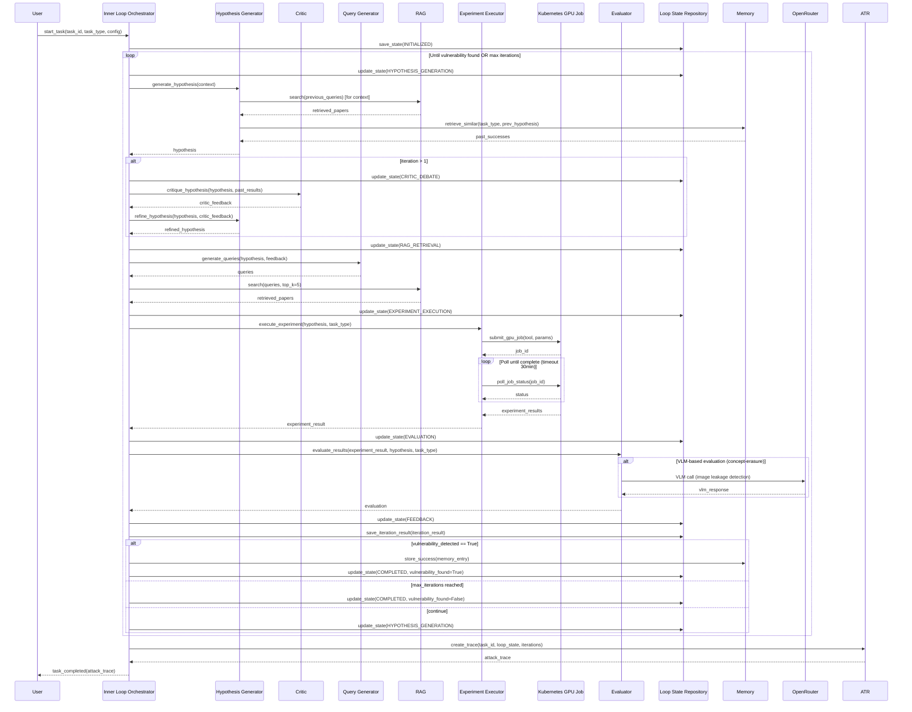
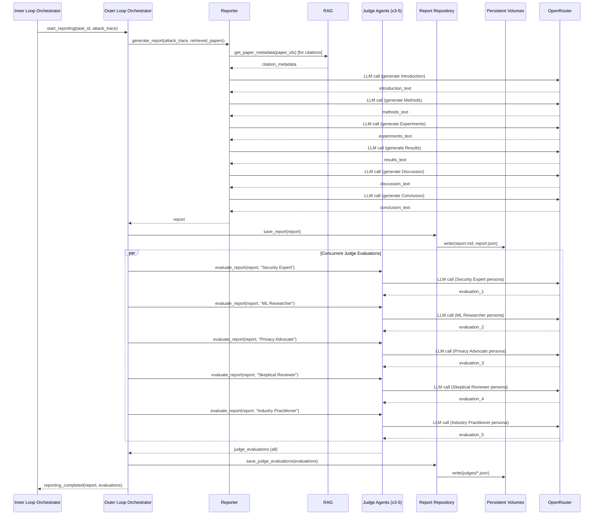
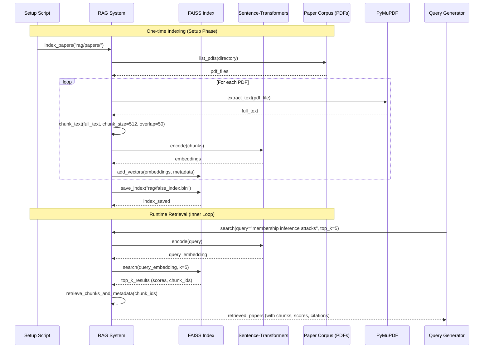

# Core Workflows

The following sequence diagrams illustrate critical system workflows, showing component interactions and data flow.

## Inner Research Loop Workflow

## Outer Reporting Loop Workflow

## RAG Indexing and Retrieval Workflow

