# High Level Architecture

## Technical Summary

AUST implements a **stateful containerized agent orchestration system** running in Docker/Kubernetes with H200 GPU access. The architecture follows a **two-loop pattern**: an inner research loop that autonomously conducts experiments through multi-agent collaboration (Hypothesis Generator, Critic, Query Generator, Evaluator, Experiment Executor), and an outer reporting loop that generates academic papers and multi-perspective judge evaluations. The system uses **CAMEL-AI** in dev/editable mode for agent orchestration, **OpenRouter API** for flexible LLM/VLM access, **RAG (Retrieval-Augmented Generation)** with Qdrant vector database for paper retrieval, and **MCP FunctionTools** to integrate DeepUnlearn and concept-erasure methods. Core architectural patterns include **event-driven agent communication**, **repository pattern for data access**, and **strategy pattern for task-specific workflows** (data-based vs concept-erasure). This architecture supports the PRD goals of demonstrating autonomous end-to-end AI scientific research on machine unlearning vulnerabilities, with aggressive performance targets (< 30 min/iteration, < 5 hours total, ≥ 90% autonomy).

## High Level Overview

**Main Architectural Style**: Stateful Containerized Monolith with Multi-Agent Orchestration

AUST uses a monolithic application architecture running in Docker containers, orchestrated by Kubernetes for GPU resource management and persistent volume mounting. The monolith is internally structured as a multi-agent system with clear component boundaries and orchestration layers.

**Repository Structure**: Monorepo at https://github.com/vios-s/CAUST containing all components (agents, tools, RAG, memory, loop orchestration, experiments) with DeepUnlearn as a git submodule and CAMEL-AI installed in dev/editable mode in an `external/` directory.

**Service Architecture**: Single Python application with stateful execution. The application maintains loop state across iterations via persistent volumes, enabling restart/resume capabilities. Experiment execution is isolated for security, with timeout and retry logic for GPU job queue management.

**Primary Data Flow**:
1. **Inner Research Loop**: User initiates task → Inner Loop Orchestrator starts → Hypothesis Generator proposes attack (using RAG + memory + seed templates) → Critic debates (if iteration > 1) → Query Generator retrieves papers → Experiment Executor triggers unlearning/erasure via MCP FunctionTools → Evaluator assesses results (threshold-based or VLM-based) → feedback to next iteration → repeat until vulnerability found or max iterations
2. **Outer Reporting Loop**: Inner loop completes → Outer Loop Orchestrator starts → Reporter generates academic paper from attack traces → 3-5 Judge personas evaluate report → outputs saved to persistent volumes

**Key Architectural Decisions**:
- **Monorepo + Monolith for MVP**: Simplifies dependency management and enables atomic commits across components, critical for aggressive 3-week timeline
- **CAMEL-AI in dev mode**: Allows source code modifications and custom agent implementations beyond framework defaults
- **MCP FunctionTools for experiments**: Provides safe, versioned integration with external codebases (DeepUnlearn, concept-erasure repos)
- **RAG with vector DB**: Enables semantic search over research papers to improve hypothesis quality and novelty
- **Dual-format outputs**: JSON (machine-readable) + Markdown (human-readable) for attack traces and reports, supporting both analysis and paper integration
- **Task-specific strategies via prompts**: Unified workflow architecture with prompt-based differentiation for data-based vs concept-erasure tasks

## High Level Project Diagram

```mermaid
graph TB
    User[User/Researcher]

    subgraph InnerLoop[Inner Research Loop Orchestrator]
        HG[Hypothesis Generator]
        Critic[Critic Agent]
        QG[Query Generator]
        EE[Experiment Executor]
        Eval[Evaluator]
    end

    subgraph OuterLoop[Outer Reporting Loop]
        Reporter[Reporter Agent]
        Judges[Judge Agents x3-5]
    end

    subgraph KnowledgeLayer[Knowledge Layer]
        RAG[RAG System<br/>FAISS/Chroma]
        Memory[Long-Term Memory<br/>CAMEL-AI]
        Papers[Paper Corpus<br/>10-20 per domain]
    end

    subgraph ExperimentLayer[Experiment Execution Layer]
        DUFT[DeepUnlearn<br/>FunctionTool]
        CEFT[Concept-Erasure<br/>FunctionTool]
        GPU[H200 GPU<br/>Kubernetes Jobs]
    end

    subgraph ExternalAPIs[External Services]
        OpenRouter[OpenRouter API<br/>LLM/VLM]
    end

    subgraph Storage[Persistent Storage]
        Outputs[Outputs Volume<br/>traces/reports/judgments]
        LoopState[Loop State JSON]
        MemStore[Memory Store]
    end

    User -->|initiates task| InnerLoop
    HG -->|generates hypothesis| Critic
    Critic -->|challenges| HG
    HG -->|hypothesis needs| QG
    QG -->|search queries| RAG
    RAG -->|relevant papers| QG
    QG -->|retrieved knowledge| HG
    HG -->|hypothesis| EE
    EE -->|experiment params| DUFT
    EE -->|experiment params| CEFT
    DUFT -->|uses| GPU
    CEFT -->|uses| GPU
    EE -->|results| Eval
    Eval -->|feedback| HG
    Eval -->|vulnerability found?| InnerLoop

    InnerLoop -->|completed| OuterLoop
    Reporter -->|generates| Outputs
    Judges -->|evaluate| Outputs

    HG -.->|queries past successes| Memory
    Memory -.->|stores discoveries| MemStore
    RAG -.->|indexes| Papers

    HG -->|LLM calls| OpenRouter
    Critic -->|LLM calls| OpenRouter
    QG -->|LLM calls| OpenRouter
    Eval -->|VLM calls for concept-erasure| OpenRouter
    Reporter -->|LLM calls| OpenRouter
    Judges -->|LLM calls| OpenRouter

    InnerLoop -.->|persists state| LoopState
    OuterLoop -.->|saves outputs| Outputs

    style InnerLoop fill:#e1f5ff
    style OuterLoop fill:#fff4e1
    style KnowledgeLayer fill:#e8f5e9
    style ExperimentLayer fill:#fce4ec
    style ExternalAPIs fill:#f3e5f5
    style Storage fill:#fff8e1
```

## Architectural and Design Patterns

**Pattern Selection**: The following patterns have been selected to guide AUST's architecture. Each pattern addresses specific requirements from the PRD while maintaining simplicity for the aggressive 3-week timeline.

- **Two-Loop Orchestration Pattern (Inner/Outer Loops)**: Separates iterative research execution (inner) from result synthesis and evaluation (outer). *Rationale:* Aligns with PRD requirement for autonomous hypothesis-experiment-feedback cycles followed by academic reporting and judging. Enables clear exit conditions and state management between phases.

- **Multi-Agent Collaboration with Role-Based Specialization**: Distinct agents (Hypothesis Generator, Critic, Query Generator, Experiment Executor, Evaluator, Reporter, Judges) with specific responsibilities. *Rationale:* Enables modular development and testing (critical for 3-week timeline), supports PRD's requirement for debate/challenge mechanisms (Critic), and allows independent agent improvements without affecting others.

- **Repository Pattern for Data Access**: Abstract data access for loop state, memory, RAG retrieval, experiment results, and outputs. *Rationale:* Enables testing without external dependencies (mocking), supports future migration from file-based to database storage, and provides clear interfaces for state persistence (NFR14).

- **Strategy Pattern for Task-Specific Workflows**: Unified agent architecture with strategy selection (via prompts and configuration) for data-based vs concept-erasure tasks. *Rationale:* Avoids code duplication while supporting distinct evaluation methods (threshold-based vs VLM-based), enables prompt-based task differentiation as specified in PRD Technical Assumptions, and simplifies maintenance.

- **Adapter Pattern for External Tool Integration**: MCP FunctionTools serve as adapters wrapping DeepUnlearn and concept-erasure repositories. *Rationale:* Provides versioned, safe integration with external codebases, enables error handling and timeout logic at integration boundary, and supports PRD requirement for container isolation (NFR12).

- **Chain of Responsibility for Error Handling**: Errors propagate through orchestrator → agent → tool layers with appropriate handling at each level. *Rationale:* Supports NFR13 (OpenRouter rate limit handling), NFR6 (experiment timeout), and overall system resilience. Enables graceful degradation when components fail.

- **Event-Driven State Machine for Loop Control**: Inner loop orchestrator manages state transitions (HYPOTHESIS_GENERATION → CRITIC_DEBATE → RAG_RETRIEVAL → EXPERIMENT_EXECUTION → EVALUATION → FEEDBACK) with clear exit conditions. *Rationale:* Provides predictable loop behavior, enables loop state persistence for restart/resume (NFR14), and simplifies debugging through clear state tracking.
