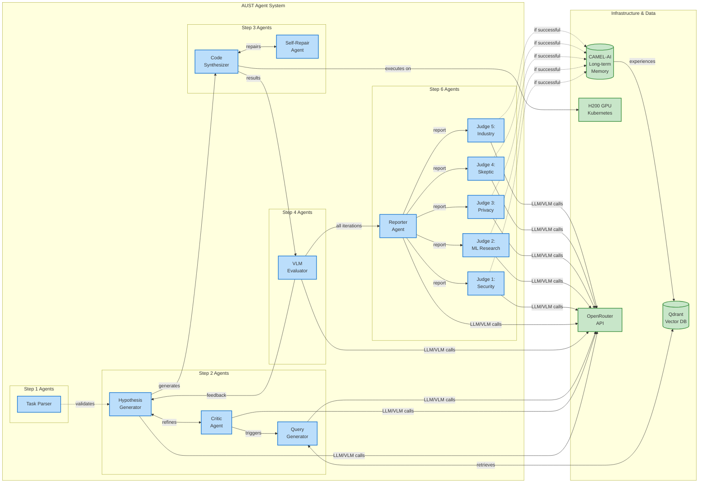
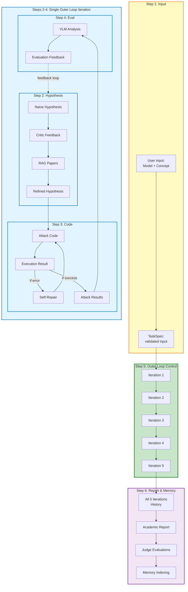

# AUST 6-Step Workflow Diagram

## Complete System Flow

```mermaid
flowchart TB
    Start([User Input]) --> Step1

    %% Step 1: Input Validation
    subgraph Step1[Step 1: Input Validation]
        direction TB
        Input[User provides:<br/>- Model details<br/>- Unlearned concept<br/>- Optional method] --> Parser[Task Parser]
        Parser --> Validate{Valid input?}
        Validate -->|No| Error[Return error message]
        Validate -->|Yes| TaskSpec[Create & Persist<br/>TaskSpec.json]
        Error --> End1([End])
    end

    TaskSpec --> Step2Init[Initialize Outer Loop<br/>iteration = 1/5]

    %% Outer Loop Container
    subgraph OuterLoop[Step 5: Outer Loop - 5 Iterations]
        direction TB
        Step2Init --> Step2

        %% Step 2: Hypothesis Generation & Critic Loop
        subgraph Step2[Step 2: Hypothesis Generation & Critic Loop]
            direction TB
            subgraph MicroLoop[2-Round Micro-Loop Minimum]
                direction TB
                Round1Start[Round 1] --> HG1[Hypothesis Generator:<br/>TaskSpec + seed template<br/>(iteration 1)]
                HG1 --> Critic1[Critic Agent:<br/>Challenge hypothesis]
                Critic1 --> QG1[Query Generator:<br/>Transform hypothesis+feedback<br/>into RAG queries]
                QG1 --> RAG1[RAG System:<br/>Retrieve relevant papers<br/>from Qdrant]
                RAG1 --> Refine1[Hypothesis Generator:<br/>Incorporate RAG papers<br/>and critic guidance]

                Refine1 --> Round2Start[Round 2]
                Round2Start --> Critic2[Critic Agent:<br/>Validate refined hypothesis]
                Critic2 --> QG2[Query Generator:<br/>Additional RAG queries<br/>if needed]
                QG2 --> RAG2[RAG System:<br/>Retrieve more papers]
                RAG2 --> Refine2[Hypothesis Generator:<br/>Final refinement with<br/>critic suggestions]
            end
            Refine2 --> FinalHyp[Final Refined Hypothesis]
        end

        FinalHyp --> Step3

        %% Step 3: Attack Code Synthesis & Execution
        subgraph Step3[Step 3: Attack Code Synthesis & Execution]
            direction TB
            subgraph SelfRepair[Self-Repair Loop - 3-5 Retry Budget]
                direction TB
                Synthesize[Code Synthesis Agent:<br/>Translate hypothesis<br/>to executable code]
                Synthesize --> Execute[Execute attack code<br/>against unlearned model]
                Execute --> Success{Execution<br/>successful?}
                Success -->|Yes| Results[Generate attack results:<br/>- Output images<br/>- Metrics<br/>- Logs]
                Success -->|No| CheckRetry{Retry budget<br/>remaining?}
                CheckRetry -->|Yes| Repair[Self-Repair Agent:<br/>Analyze error<br/>Fix code]
                Repair --> Execute
                CheckRetry -->|No| Failed[Execution failed<br/>after max retries]
            end
        end

        Results --> Step4
        Failed --> Step4

        %% Step 4: MLLM Evaluation
        subgraph Step4[Step 4: MLLM Evaluation]
            direction TB
            VLM[VLM Evaluator:<br/>Analyze attack results<br/>for concept leakage]
            VLM --> Detect{Concept<br/>leaked?}
            Detect -->|Yes| Success4[Attack Successful:<br/>Concept detected]
            Detect -->|No| Fail4[Attack Failed:<br/>No leakage]
            Detect -->|Uncertain| Inconclusive4[Inconclusive:<br/>Partial leakage]
            Success4 --> Feedback[Generate evaluation feedback]
            Fail4 --> Feedback
            Inconclusive4 --> Feedback
        end

        Feedback --> CheckIter{Outer loop<br/>iteration < 5?}
        CheckIter -->|Yes| NextIter[iteration++<br/>Feed feedback to Step 2]
        NextIter --> Step2
        CheckIter -->|No| Step6Trigger[5 iterations complete]
    end

    Step6Trigger --> Step6

    %% Step 6: Report Generation, Judging, and Memory
    subgraph Step6[Step 6: Report Generation, Judging & Memory]
        direction TB
        Reporter[Reporter Agent:<br/>Generate academic report<br/>from all 5 iterations]
        Reporter --> Report[Report sections:<br/>- Introduction<br/>- Methods<br/>- Experiments<br/>- Results<br/>- Discussion<br/>- Conclusion]

        Report --> Judges

        subgraph Judges[Multi-Persona Judge System]
            direction TB
            Judge1[Security Expert]
            Judge2[ML Researcher]
            Judge3[Privacy Advocate]
            Judge4[Skeptical Reviewer]
            Judge5[Industry Practitioner]
        end

        Judges --> Aggregate[Aggregate judge<br/>evaluations]
        Aggregate --> MemCheck{Attack<br/>successful?}
        MemCheck -->|Yes| Index[Index hypothesis + results<br/>as 'experience' in RAG]
        MemCheck -->|No| Skip[Skip memory indexing]
        Index --> Save
        Skip --> Save
        Save[Save outputs:<br/>- Report<br/>- Judge evaluations<br/>- Attack traces<br/>- Memory confirmation]
    end

    Save --> End([End - Complete])

    %% Styling
    classDef stepBox fill:#e1f5ff,stroke:#0066cc,stroke-width:3px
    classDef microBox fill:#fff4e1,stroke:#ff9800,stroke-width:2px
    classDef repairBox fill:#fce4ec,stroke:#e91e63,stroke-width:2px
    classDef judgeBox fill:#f3e5f5,stroke:#9c27b0,stroke-width:2px
    classDef outerBox fill:#e8f5e9,stroke:#4caf50,stroke-width:4px

    class Step1 stepBox
    class Step2 stepBox
    class Step3 stepBox
    class Step4 stepBox
    class Step6 stepBox
    class OuterLoop outerBox
    class MicroLoop microBox
    class SelfRepair repairBox
    class Judges judgeBox
```

## Agent Interaction Diagram



## Data Flow Through 6 Steps



## Timeline View: 5 Outer Loop Iterations

```mermaid
gantt
    title AUST 6-Step Workflow Timeline
    dateFormat X
    axisFormat %s

    section Step 1
    Input Validation           :done, s1, 0, 1

    section Iteration 1
    Step 2: Hypothesis & Critic (2 rounds) :active, i1s2, 1, 3
    Step 3: Code Synthesis & Repair        :i1s3, 3, 5
    Step 4: MLLM Evaluation                :i1s4, 5, 6

    section Iteration 2
    Step 2: Hypothesis & Critic (2 rounds) :i2s2, 6, 8
    Step 3: Code Synthesis & Repair        :i2s3, 8, 10
    Step 4: MLLM Evaluation                :i2s4, 10, 11

    section Iteration 3
    Step 2: Hypothesis & Critic (2 rounds) :i3s2, 11, 13
    Step 3: Code Synthesis & Repair        :i3s3, 13, 15
    Step 4: MLLM Evaluation                :i3s4, 15, 16

    section Iteration 4
    Step 2: Hypothesis & Critic (2 rounds) :i4s2, 16, 18
    Step 3: Code Synthesis & Repair        :i4s3, 18, 20
    Step 4: MLLM Evaluation                :i4s4, 20, 21

    section Iteration 5
    Step 2: Hypothesis & Critic (2 rounds) :i5s2, 21, 23
    Step 3: Code Synthesis & Repair        :i5s3, 23, 25
    Step 4: MLLM Evaluation                :i5s4, 25, 26

    section Step 6
    Report Generation                      :s6r, 26, 28
    Multi-Persona Judging (parallel)       :s6j, 28, 29
    Memory Indexing                        :s6m, 29, 30
```

## Key Architecture Points

### Nested Loop Structure
- **Outer Loop (Step 5)**: 5 iterations of Steps 2-4
- **Micro-loop (Step 2)**: 2-round minimum Hypothesis → Critic → Query → Refine
- **Self-Repair Loop (Step 3)**: 3-5 retry attempts for code execution

### Critical Data Flows
1. **Step 1 → Step 2**: TaskSpec provides context for hypothesis generation
2. **Step 4 → Step 2**: Evaluation feedback feeds back to improve next hypothesis (across outer loop iterations)
3. **Step 2 internal**: Critic feedback triggers Query Generator → RAG → Hypothesis refinement
4. **Step 3 internal**: Execution errors trigger Self-Repair → Code regeneration
5. **All iterations → Step 6**: Complete history used for report generation
6. **Step 6 → RAG**: Successful attacks indexed as "experience" for future retrieval

### Agent Coordination
- **Step 1**: 1 agent (Task Parser)
- **Step 2**: 3 agents (Hypothesis Generator, Critic, Query Generator) + RAG system
- **Step 3**: 2 agents (Code Synthesizer, Self-Repair)
- **Step 4**: 1 agent (VLM Evaluator)
- **Step 5**: Orchestrator (no new agents, coordinates Steps 2-4)
- **Step 6**: 7 agents (Reporter + 5 Judges) + Memory system
